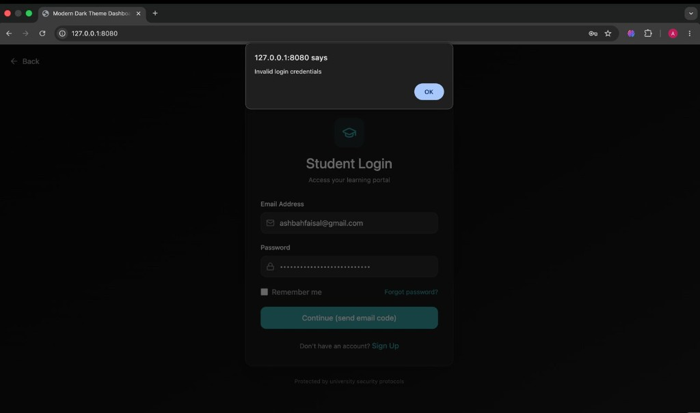
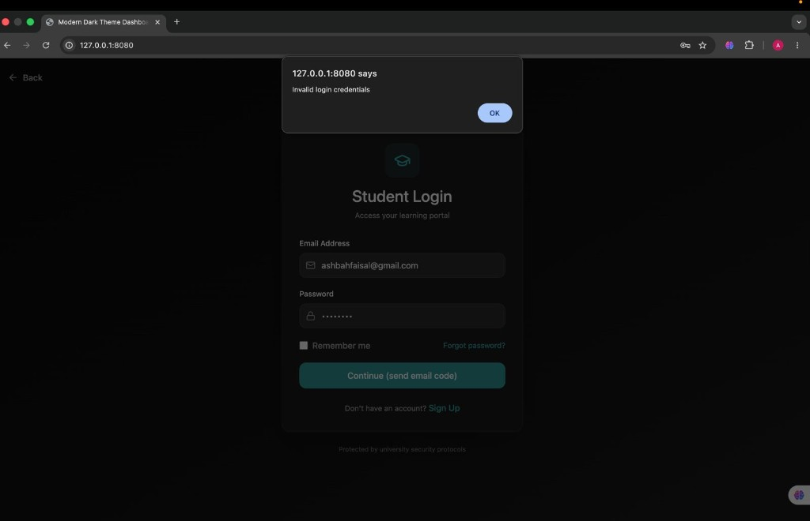
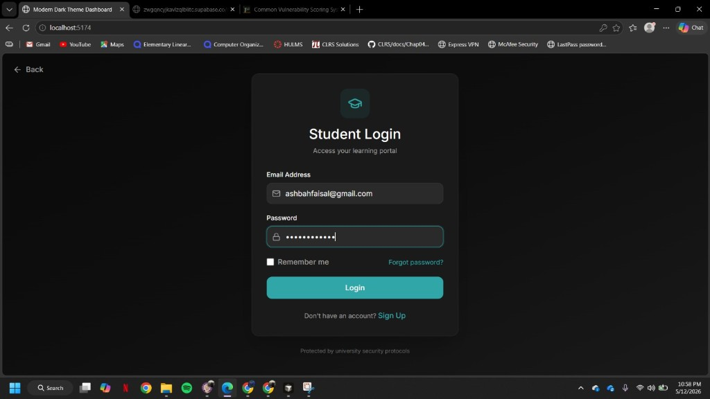
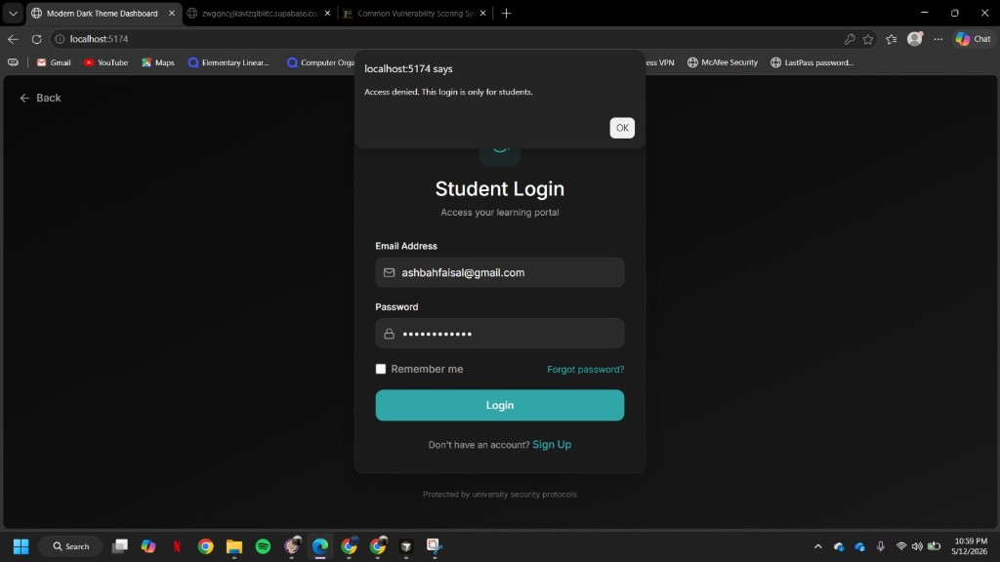
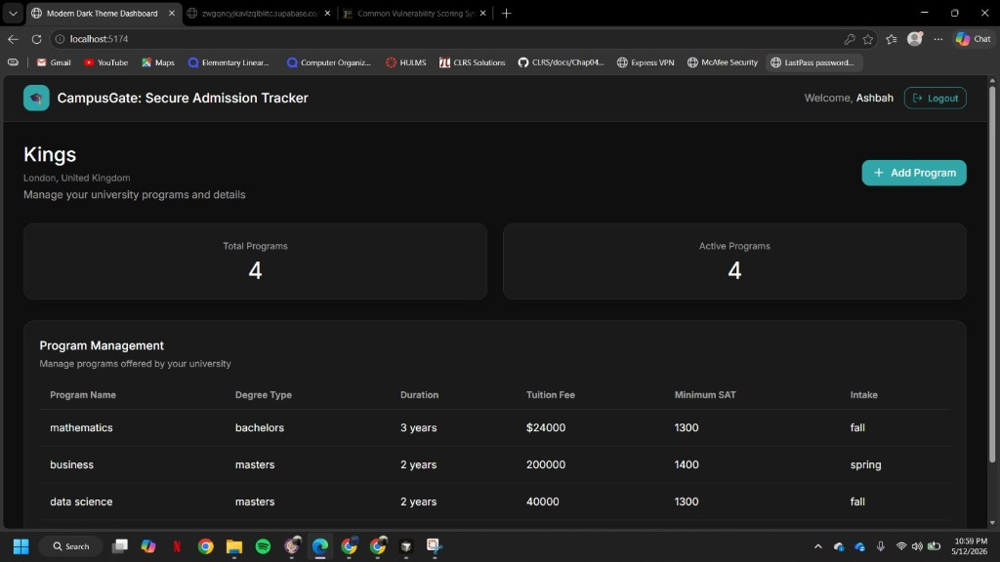
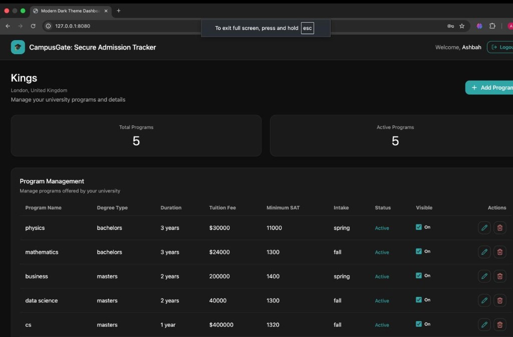

# DevSecOps Security Project — Final Technical Report

**Course:** Cybersecurity: Theory, Tools-L1  
**Project:** CampusGate — Secure Admission Tracker  
**Group:** Project Group 5  
**Repository:** [https://github.com/breehaqasim/CampusGate-Secure-Admission-Tracker](https://github.com/breehaqasim/CampusGate-Secure-Admission-Tracker)  
**Date:** 12 May 2026  
**Authors:** Ashbah Faisal, Breeha Qasim & Namel Shahid

---

## Table of Contents

1. [Executive Summary (non-technical)](#1-executive-summary-non-technical)
2. [Application overview](#2-application-overview)
3. [Architecture & Threat Model](#3-architecture--threat-model)
4. [DevSecOps Pipeline (GitHub / CI-CD)](#4-devsecops-pipeline-github--ci-cd)
5. [Security Testing Methodology](#5-security-testing-methodology)
6. [Vulnerability Discovery & Analysis](#6-vulnerability-discovery--analysis)
7. [Exploitation Report](#7-exploitation-report)
8. [Remediation & Re-test](#8-remediation--re-test)
9. [Member Contributions](#9-member-contributions)
10. [References & Appendices](#10-references--appendices)

---

## 1. Executive Summary (non-technical)

**Purpose.** This report explains how **CampusGate** — our secure admission tracker for universities and students — was designed, built, and tested under a **DevSecOps** lens. It is written for instructors and reviewers who want outcomes and trade-offs without reading every config line or scanner export.

**What we built.** A **web application** backed by **Supabase** where users sign in with clear **roles** (for example university administrators versus students). Administrators manage **programmes, tuition, and admissions-related data** with **search and filters**; students use a separate entry path. Data is **stored in the cloud database** so it persists across sessions in normal use.

**How we secured it.** We used **threat modelling** before implementation, then **Docker** so the app ships in a **repeatable container** served by **nginx**. On every push and pull request to GitHub, **automated checks** run: **SonarCloud** for code quality and security-relevant patterns (**SAST**), **Grype** for software bills of materials and known weaknesses in dependencies and the **image** (**SCA**), and **OWASP ZAP** against a running build (**DAST**), with **quality gates** where tools can fail the pipeline on serious issues. We also ran **manual tests** for real-world problems tools miss easily — weak passwords, login abuse, **wrong portal still granting admin access**, and **session behaviour after a page refresh**.

**Key outcomes.**

- **Strengths:** A single **GitHub Actions** pipeline runs **SAST, SCA, and DAST** together; the container image was **hardened** (updated base, fewer optional packages, layered **nginx** security headers including **CSP**, **COOP/COEP/CORP**, **`X-Content-Type-Options: nosniff`**, and **`Permissions-Policy`**); critical and high issues from **supply-chain scanning** and **dynamic scans** were **closed with evidence** (commits, workflow artifacts, and **GitHub issues** where used). Manual findings were **reproduced and verified fixed** with screenshots in the appendix.
- **Issues found:** We tracked **28** discrete findings (**F-01**–**F-28**): seven from **static analysis** (maintainability and clarity on sensitive code paths), seven from **image and dependency scanning** (including one **critical**-rated library issue and **high**-rated items), **ten** from **dynamic scanning** of HTTP headers and policy, and four from **manual** authentication and access-control testing.
- **Remediation:** **All 28** findings are recorded as **Fixed** in **§6.1**. Work included **TypeScript refactors**, **nginx / CSP** tuning (wildcard sources, style directives, MIME sniffing), **Dockerfile** and **CI scan** hardening, and **application-level** auth and RBAC fixes. Re-test is summarised in **§8.3** with workflow links and **artifact** names (`sonarcloud-report`, `dast-zap-reports`, `sca-reports`).
- **Remaining risk:** No open rows in the master register. **Ongoing** exposure is the same as for any web product: **new CVEs** in dependencies and base images, **configuration drift**, and **feature changes** that reintroduce logic bugs — mitigated by **keeping the pipeline on**, **weekly scheduled SCA**, and **targeted manual tests** after permission or auth changes.

**Recommendation.** Keep running the **full pipeline on every merge to `main`**, store **Supabase and Sonar tokens only in GitHub Secrets**, repeat **DAST** after nginx or CSP changes, and schedule **manual RBAC checks** whenever roles, login screens, or session logic change.

---

## 2. Application overview

### 2.1 Application overview

**Application name:** CampusGate — Secure Admission Tracker  

**Purpose:** A university admission exploration and management experience with **role-based access** for students, university administrators, and a **super admin**. The product supports browsing and favouriting institutions, structured university and program data, and an **admin approval path** for university admins before they reach the full admin dashboard. The system was designed and built as a DevSecOps **“build and break”** security assignment: containerised delivery, automated **SAST / SCA / DAST**, threat modelling, manual testing, and documented remediation.

**Rationale:** **Motivation.** Students and families routinely compare many universities, programmes, fees, and deadlines using scattered websites, PDFs, and spreadsheets—work that is easy to get wrong and hard to repeat each cycle. Institutions also need a controlled way to present **their** offerings and to know **who** is allowed to act on their behalf. CampusGate is motivated as a **small, clear hub**: explore and shortlist institutions, keep structured programme data in one place, and separate **student**, **institution**, and **platform** responsibilities.

**Does this problem really exist?** **Yes.** University admissions and pathway decisions are a recurring, high-stakes process worldwide. Issues that appear in the real world include: **out-of-date or inconsistent programme information**, **weak or opaque account provisioning for “official” reps**, **over-collection or mishandling of personal data**, and **confusion about permissions** (who may edit what). Our project is a **simplified model** of that reality—enough structure to exercise **RBAC, sessions, CRUD, and a database** in a way that still maps to genuine stakeholder pain points, without claiming to replace full national clearinghouse or enrolment systems.

### 2.2 Tech stack

| Layer | Technology |
|--------|------------|
| **Frontend** | React 18, TypeScript, Vite 6, Tailwind CSS 4, MUI, Radix UI, Emotion, react-hook-form, Recharts, `@supabase/supabase-js` |
| **Backend / BaaS** | Supabase (Auth, PostgreSQL, REST/RPC as used by the client) |
| **Database** | PostgreSQL (Supabase); tables include `profiles`, `universities`, `university_programs` |
| **Auth & session** | Supabase Auth; `authService` logout; inactivity timeout in `App.tsx` |
| **RBAC** | `profiles.role`, `approved` (university admin); enforce with Supabase RLS |
| **Containerisation** | Docker (multi-stage: Node 20.19.2-alpine3.21 build, nginx 1.28.3-alpine runtime), `nginx.conf`, `nginx-csp.inc` |
| **CI/CD** | GitHub Actions (SonarCloud, Syft/Grype, ZAP — see §4) |

### 2.3 User roles

| Role | Access level |
|------|----------------|
| **Student** | Register / login; student dashboard; browse **universities** and details; **favourites**; search/filter within the student experience |
| **University admin** | Register / login; if not **`approved`**, remains on login path; once approved — **university admin dashboard** and **CRUD** on managed universities/programs via Supabase |
| **Super admin** | Register / login; **super admin dashboard** — system-wide oversight per that screen’s features |

---

## 3. Architecture & Threat Model

### 3.1 Architecture diagram


*Figure 3.1 — High-level architecture and trust boundaries: HTTPS clients → Docker (nginx, static React/Vite SPA) → Supabase (Auth + PostgreSQL); GitHub repository and Actions for SAST, SCA, and DAST.*

### 3.2 Attack surface

| Entry point | Type | Notes |
|-------------|------|--------|
| **Public web (nginx → static SPA)** | Network / HTTP | **Port 80** in Docker; production would typically sit behind **TLS** (443). Delivers **HTML/JS/CSS** and cached assets; primary exposure is **browser-side execution** and **HTTP security headers** (see DAST F-15–F-24, §6). |
| **Supabase Auth (`auth/v1/*`)** | Authentication | **Sign-up, sign-in, password reset, OTP, JWT refresh** — invoked from the SPA with the **anon key**; risks include **weak passwords (F-25)**, **online guessing / stuffing (F-26)**, and **token/session mishandling (F-28)**. |
| **Student vs university admin entry** | Authorisation | **Separate login/registration paths**; surface for **wrong-portal access** and **vertical escalation** if session is created before role checks (**F-27**). |
| **Supabase data API (PostgREST / client queries)** | Authorisation / data | **`profiles`**, **`universities`**, **`university_programs`** — CRUD and reads from the SPA. Enforced with **RLS** and **`profiles.role` / `approved`**; residual risk is **misconfigured policies** or **client-side assumptions** bypassed by direct API use. |
| **Search, filters, and programme forms** | Input / integrity | **Client-side** validation and React forms; server-side policy via **RLS** and typed columns — not a classic SQLi surface from the app tier, but **XSS** and **logic abuse** still matter (CSP mitigations §6 / nginx). |
| **CI-built container image** | Supply chain | **Node build + nginx:alpine** runtime; **Syft/Grype** flagged **stdlib / libtiff** class issues in SBOMs (**F-08–F-14**). **No server-side file upload** in this product scope. |

### 3.3 Threat model methodology

The CampusGate threat model was developed using the **STRIDE** methodology to identify threats across authentication, session management, API communication, and database interactions. The analysis focused on the Supabase PostgreSQL backend, authentication module, approval workflows, and university management operations identified in the DFD.

Threats identified in the Microsoft Threat Modeling report primarily included:

* Unauthorized access to Supabase PostgreSQL instances,
* Weak TLS/database communication configuration,
* Persistent access through compromised credentials,
* Tampering with transmitted data,
* Privilege escalation risks within approval and management workflows.

Risk prioritisation was performed using a qualitative risk matrix combined with **CVSS v3.1** severity estimation for manual testing, DAST, and SAST findings.

---

#### 3.3.1 STRIDE per major component

| Component | S | T | R | I | D | E | Mitigation summary |
|-----------|---|---|---|---|---|---|---------------------|
| Browser session | Session hijacking through stolen tokens | Cookie/session tampering | Users denying performed actions | Exposure of session tokens or profile data | Session flooding / brute force login attempts | Privilege escalation through weak RBAC checks | Secure JWT sessions, HTTPS, CSP, logout invalidation, role-based route protection |
| API / edge | Spoofed requests using stolen credentials | Parameter manipulation and request tampering | Missing request traceability | Exposure of sensitive API responses | Excessive requests causing service degradation | Broken access control / IDOR attacks | TLS enforcement, input validation, RBAC middleware, rate limiting, authenticated API checks |
| Database (Supabase PostgreSQL) | Unauthorized DB access | Data modification in transit | Lack of audit visibility | Leakage of user/application data | Resource exhaustion attacks | Persistent elevated access through credential compromise | Row Level Security (RLS), least privilege access, TLS-enforced DB communication, credential rotation, secure secret storage |

### 3.4 Threat prioritisation

| Threat ID | Description | Likelihood | Impact | Risk score | Linked test (SAST/DAST/manual) |
|-----------|-------------|------------|--------|------------|--------------------------------|
| TM-01 | Unauthorized access to Supabase PostgreSQL due to weak network security configuration | Medium | High | High | Threat model + manual testing |
| TM-02 | Data tampering or interception during PostgreSQL communication due to weak TLS configuration | Medium | High | High | DAST + manual |
| TM-03 | Persistent access through compromised database credentials or leaked secrets | Medium | High | High | SAST + manual |
| TM-04 | Broken RBAC allowing unauthorized university management actions | Medium | High | High | Manual pentesting |
| TM-05 | IDOR through manipulated UUID/profile identifiers | Medium | High | High | DAST + manual |
| TM-06 | Session token reuse after logout or weak session invalidation | Low | Medium | Medium | Manual testing |
| TM-07 | XSS through unsanitized form inputs or search parameters | Medium | Medium | Medium | DAST + manual |
| TM-08 | Brute force attacks against authentication endpoints | Medium | Medium | Medium | DAST |
| TM-09 | Exposure of sensitive configuration or public API endpoints | Low | Medium | Medium | SAST + DAST |

### 3.5 Threat model updates post-remediation

Post-remediation, the threat model was updated to reflect the newly implemented security controls, hardened trust boundaries, and reduced attack surface of the system. The Authentication Module was strengthened by introducing strong password validation, login rate limiting, session token validation, RBAC enforcement, and portal access enforcement to prevent unauthorized access, brute-force attacks, and privilege escalation. Trust boundaries were refined around the authentication and database interaction layers to better represent secure credential verification and session management with Supabase. The frontend exposure surface was reduced by introducing a hardened nginx security layer with Content Security Policy (CSP), anti-clickjacking protections, Cross-Origin policies (COOP, COEP, CORP), `X-Content-Type-Options`, `Permissions-Policy`, and hidden server banners. The container attack surface was also minimized by removing unnecessary packages and vulnerable image-processing components such as `libtiff` and unused nginx modules from the Docker image. Additionally, the updated threat model now includes DevSecOps security controls within the CI/CD pipeline, representing automated SAST, SCA, and DAST validation with quality gates to continuously identify and block high-risk vulnerabilities before deployment.


---

## 4. DevSecOps Pipeline (GitHub / CI-CD)

### 4.1 Pipeline overview

| Stage | Tool | Trigger | Artifact / output | Pass/fail policy |
|-------|------|---------|-------------------|------------------|
| **SAST** | **SonarCloud** via `SonarSource/sonarqube-scan-action@v8` (workflow **`sonar.yml`**) | `push` and `pull_request` to **`main`** | Job summary + artifact **`sonarcloud-report`** (`quality-gate.json`, `measures.json`, `issues-full.json`, …) | Fails when the **SonarCloud quality gate** for the project is not met. |
| **SCA** | **Syft** (CycloneDX SBOM) + **Grype** (scan SBOMs); workflow **`syft-sbom.yml`** | `push` and `pull_request` to **`main`**, plus **nightly** `cron: "0 2 * * *"` (UTC) | Artifact **`sca-reports`**: `sbom.json`, `sbom-dockerimage.json`, `grype-source.json`, `grype-image.json` | Fails if **actionable** High or Critical exist (`vulnerability.fix.state == "fixed"`), after excluding `stdlib` matches and stripping SBOM `metadata.tools`. Summary still lists raw High/Critical counts. |
| **DAST** | **OWASP ZAP Baseline** (`zap-baseline.py`) in **`ghcr.io/zaproxy/zaproxy:stable`**; workflow **`dast.yml`** | `push` and `pull_request` to **`main`** | Artifact **`dast-zap-reports`**: `report.html`, `report.json`; rules in **`dast/zap-baseline-rules.conf`** | Step fails on ZAP **exit code 3** (fatal). Separate gate fails if `report.json` has any **High** or **Critical** alerts. |
| **Build / Docker** | **`docker build`** in SCA and DAST (image tags **`campusgate:ci`** / **`campusgate:dast`**) with CI-only **`VITE_*` placeholders** | Same triggers as the jobs that embed the step | Image used for Syft image SBOM + Grype; DAST runs container **`8080:80`** and ZAP hits **`http://127.0.0.1:8080/`** | Build must succeed before SBOM or ZAP; DAST waits until HTTP responds. |

**Evidence:** [https://github.com/breehaqasim/CampusGate-Secure-Admission-Tracker/actions](https://github.com/breehaqasim/CampusGate-Secure-Admission-Tracker/actions) — filter by **SonarQube Analysis**, **SCA — SBOM + Vulnerability Gate**, **DAST — OWASP ZAP**

### 4.2 Branching and quality gates

- **Default branch:** `main` (all three workflows use `push` / `pull_request` on `main`).
- **Feature / fix branches:** e.g. `fix/12-sca-hardening` → open **PR** into `main` so CI runs before merge.
- **Pull requests:** enable **branch protection** (if available) and require **`sonar.yml`**, **`syft-sbom.yml`**, and **`dast.yml`** to pass before merge.
- **Issue linkage:** commit messages reference issues, e.g. `fix #12: …` 

### 4.3 Secrets and configuration

- **Repository secrets (names only):** `SONAR_TOKEN` — **`sonar.yml`** (SonarCloud scan + API export).
- **Built-in:** `GITHUB_TOKEN` — passed to the Sonar action; workflow `permissions: contents: read`.
- **Local only (do not commit):** real `VITE_SUPABASE_URL` and `VITE_SUPABASE_ANON_KEY` for development. CI **`docker build`** uses **placeholder** values so pipelines run without production Supabase credentials.

---

## 5. Security Testing Methodology

### 5.1 Pipeline overview (GitHub Actions)

Security automation lives in **three workflow files** under `.github/workflows/`. On every **`push`** and **`pull_request`** to **`main`**, GitHub Actions starts **one run per workflow** (they usually **execute in parallel**, as independent checks). **SCA** also runs on a **weekly schedule** (`cron` in `syft-sbom.yml`). There is **no** separate `coverage.yml`, `sast.yml`/`sca.yml` for Python, or Bandit/Semgrep in this repository — static analysis is **SonarCloud**, supply chain is **Syft + Grype**, and dynamic testing is **ZAP**.

```
Push / PR to main
   │
   ├── [sonar.yml]         SonarCloud SAST → API export → artifact sonarcloud-report
   ├── [syft-sbom.yml]     docker build → Syft (source + image SBOM) → Grype + gate → artifact sca-reports
   └── [dast.yml]          docker build → run container :8080 → ZAP Baseline → gate → artifact dast-zap-reports
```

**Pipeline file locations**

| Path | Purpose |
|------|---------|
| `.github/workflows/sonar.yml` | **SAST** — SonarCloud scan + SonarCloud API JSON export |
| `.github/workflows/syft-sbom.yml` | **SCA** — Syft CycloneDX SBOMs + Grype scans + actionable High/Critical gate |
| `.github/workflows/dast.yml` | **DAST** — Build image, run nginx SPA, OWASP ZAP Baseline, High/Critical gate |

**Artifacts uploaded** (names from the workflows): **`sonarcloud-report`** (e.g. `quality-gate.json`, `measures.json`, `issues-full.json`), **`sca-reports`** (`sbom.json`, `sbom-dockerimage.json`, `grype-source.json`, `grype-image.json`), **`dast-zap-reports`** (`report.html`, `report.json` under `dast-reports/`).

### 5.2 SAST

- **Tool:** **SonarCloud** analysis via **`SonarSource/sonarqube-scan-action@v8`** (`sonar.yml`).

**SAST Summary**

| Severity | Count |
|----------|------:|
| High | 7 |
| Medium | 45 |
| Low | 131 |

### 5.3 SCA

- **Tool:** **Syft** (SBOM, **CycloneDX JSON**) and **Grype** (vulnerability scan against SBOMs). Installers in CI pull current **Syft** and **Grype** releases (`syft-sbom.yml`).

**SCA Summary**

| Metric | Count |
|--------|------:|
| Source High | 8 |
| Source Critical | 1 |
| Image High | 1 |
| Image Critical | 0 |
| Total High | 9 |
| Total Critical | 1 |

### 5.4 DAST

- **Tool:** **OWASP ZAP Baseline** (`zap-baseline.py`) using image **`ghcr.io/zaproxy/zaproxy:stable`**, with custom config **`dast/zap-baseline-rules.conf`** (`dast.yml`).

**DAST summary** (alerts by risk level — e.g. ZAP HTML report summary):

| Risk level | Number of alerts |
|------------|----------------:|
| High | 0 |
| Medium | 2 |
| Low | 6 |
| Informational | 2 |
| False positives | 0 |

### 5.5 Manual penetration testing

- **Focus:** **Broken access control** (horizontal/vertical privilege issues, object references / IDOR-style IDs in Supabase calls), **session lifecycle** (login, refresh, logout, inactivity timeout), **business logic** (e.g. `approved` / `role` handling, mass-assignment-style fields if exposed, invalid or boundary inputs on forms).
- **Tools:** **Browser DevTools** (Chrome or Edge): **Network** (requests/responses, status codes, cookies), **Application** (storage, session), **Console** (errors), **Elements** / **Sources** as needed — primary tool for manual review of the SPA and Supabase traffic.

---

## 6. Vulnerability Discovery & Analysis

### 6.1 Summary table (master findings register)

| ID | Title | Detection | OWASP 2021 | Severity | CVSS v3.1 base | CVSS v3.1 vector | Source | Status |
|----|--------|-----------|------------|----------|----------------|------------------|--------|--------|
| F-01 | Remove use of `void` operator (`onClick` handler) | SonarCloud `typescript:S3735` | A04 Insecure Design | High (maintainability) | 4.3 | `CVSS:3.1/AV:L/AC:L/PR:L/UI:R/S:U/C:L/I:L/A:N` | SAST | Fixed |
| F-02 | Cognitive complexity too high — `UniversityDetailsScreen` | SonarCloud `typescript:S3776` | A04 Insecure Design | High (maintainability) | 4.8 | `CVSS:3.1/AV:L/AC:L/PR:L/UI:R/S:U/C:L/I:L/A:L` | SAST | Fixed |
| F-03 | Cognitive complexity too high — `approveAdmin` | SonarCloud `typescript:S3776` | A04 Insecure Design | High (maintainability) | 5.3 | `CVSS:3.1/AV:L/AC:L/PR:L/UI:R/S:U/C:L/I:L/A:L` | SAST | Fixed |
| F-04 | Cognitive complexity too high — `getAdminUniversityContext` | SonarCloud `typescript:S3776` | A04 Insecure Design | High (maintainability) | 5.3 | `CVSS:3.1/AV:L/AC:L/PR:L/UI:R/S:U/C:L/I:L/A:L` | SAST | Fixed |
| F-05 | Cognitive complexity too high — `addUniversityProgram` | SonarCloud `typescript:S3776` | A04 Insecure Design | High (maintainability) | 5.3 | `CVSS:3.1/AV:L/AC:L/PR:L/UI:R/S:U/C:L/I:L/A:L` | SAST | Fixed |
| F-06 | Cognitive complexity too high — `updateUniversityProgram` | SonarCloud `typescript:S3776` | A04 Insecure Design | High (maintainability) | 5.3 | `CVSS:3.1/AV:L/AC:L/PR:L/UI:R/S:U/C:L/I:L/A:L` | SAST | Fixed |
| F-07 | Cognitive complexity too high — `addUniversity` | SonarCloud `typescript:S3776` | A04 Insecure Design | High (maintainability) | 5.3 | `CVSS:3.1/AV:L/AC:L/PR:L/UI:R/S:U/C:L/I:L/A:L` | SAST | Fixed |
| F-08 | CVE-2025-68121 — Go `crypto/tls` session resumption / trust boundary | Grype (Go stdlib) | A06 Vulnerable and Outdated Components | Critical | 10.0 | `CVSS:3.1/AV:N/AC:L/PR:N/UI:N/S:C/C:H/I:H/A:H` | SCA | Fixed |
| F-09 | CVE-2023-52356 — libtiff heap overflow / DoS (`TIFFReadRGBATileExt`) | Grype | A06 Vulnerable and Outdated Components | High | 7.5 | `CVSS:3.1/AV:N/AC:L/PR:N/UI:N/S:U/C:N/I:N/A:H` | SCA | Fixed |
| F-10 | CVE-2025-58187 — Certificate Validation Resource Exhaustion (Go `crypto/x509`) | Grype (Go stdlib) | A06 Vulnerable and Outdated Components | High | 7.5 | `CVSS:3.1/AV:N/AC:L/PR:N/UI:N/S:U/C:N/I:N/A:H` | SCA | Fixed |
| F-11 | CVE-2025-58188 — Go DSA cert validation panic | Grype (Go stdlib) | A06 Vulnerable and Outdated Components | High | 7.5 | `CVSS:3.1/AV:N/AC:L/PR:N/UI:N/S:U/C:N/I:N/A:H` | SCA | Fixed |
| F-12 | CVE-2025-61723 — Go PEM parsing resource exhaustion | Grype (Go stdlib) | A06 Vulnerable and Outdated Components | High | 7.5 | `CVSS:3.1/AV:N/AC:L/PR:N/UI:N/S:U/C:N/I:N/A:H` | SCA | Fixed |
| F-13 | CVE-2025-61725 — Go `ParseAddress` CPU amplification | Grype (Go stdlib) | A06 Vulnerable and Outdated Components | High | 7.5 | `CVSS:3.1/AV:N/AC:L/PR:N/UI:N/S:U/C:N/I:N/A:H` | SCA | Fixed |
| F-14 | CVE-2025-61726 — Go `net/url` query-param memory growth | Grype (Go stdlib) | A06 Vulnerable and Outdated Components | High | 7.5 | `CVSS:3.1/AV:N/AC:L/PR:N/UI:N/S:U/C:N/I:N/A:H` | SCA | Fixed |
| F-15 | Content-Security-Policy (CSP) header not set | OWASP ZAP Baseline plugin **10038** | A05 Security Misconfiguration | Medium | 6.1 | `CVSS:3.1/AV:N/AC:L/PR:N/UI:R/S:C/C:L/I:L/A:N` | DAST | Fixed |
| F-16 | Missing anti-clickjacking header (`X-Frame-Options` / CSP `frame-ancestors`) | OWASP ZAP Baseline plugin **10020** | A05 Security Misconfiguration | Medium | 4.3 | `CVSS:3.1/AV:N/AC:L/PR:N/UI:R/S:U/C:L/I:L/A:N` | DAST | Fixed |
| F-17 | Cross-Origin-Embedder-Policy (COEP) header missing or invalid | OWASP ZAP Baseline plugin **90004** | A05 Security Misconfiguration | Low | 3.7 | `CVSS:3.1/AV:N/AC:H/PR:N/UI:R/S:U/C:L/I:N/A:N` | DAST | Fixed |
| F-18 | Permissions-Policy header not set | OWASP ZAP Baseline plugin **10063** | A05 Security Misconfiguration | Low | 3.1 | `CVSS:3.1/AV:N/AC:H/PR:N/UI:R/S:U/C:L/I:N/A:N` | DAST | Fixed |
| F-19 | Server response header leaks version (`Server: nginx/…`) | OWASP ZAP Baseline plugin **10036** | A05 Security Misconfiguration | Low | 2.6 | `CVSS:3.1/AV:N/AC:H/PR:N/UI:N/S:U/C:L/I:N/A:N` | DAST | Fixed |
| F-20 | CSP: wildcard / broad sources (`img-src`, `media-src`, etc.) | OWASP ZAP Baseline plugin **10055** | A05 Security Misconfiguration | Medium | 5.4 | `CVSS:3.1/AV:N/AC:L/PR:N/UI:R/S:C/C:L/I:L/A:N` | DAST | Fixed |
| F-21 | CSP: `style-src` includes `'unsafe-inline'` | OWASP ZAP Baseline plugin **10055** | A05 Security Misconfiguration | Medium | 6.1 | `CVSS:3.1/AV:N/AC:L/PR:N/UI:R/S:C/C:L/I:L/A:N` | DAST | Fixed |
| F-22 | Cross-Origin-Opener-Policy (COOP) header missing or invalid | OWASP ZAP Baseline plugin **90004** | A05 Security Misconfiguration | Low | 3.7 | `CVSS:3.1/AV:N/AC:H/PR:N/UI:R/S:U/C:L/I:N/A:N` | DAST | Fixed |
| F-23 | Cross-Origin-Resource-Policy (CORP) header missing or invalid | OWASP ZAP Baseline plugin **90004** | A05 Security Misconfiguration | Low | 3.7 | `CVSS:3.1/AV:N/AC:H/PR:N/UI:R/S:U/C:L/I:N/A:N` | DAST | Fixed |
| F-24 | `X-Content-Type-Options` header missing (`nosniff`) | OWASP ZAP Baseline plugin **10021** | A05 Security Misconfiguration | Low | 3.1 | `CVSS:3.1/AV:N/AC:H/PR:N/UI:R/S:U/C:L/I:N/A:N` | DAST | Fixed |
| F-25 | Weak password accepted or weak policy | Manual authentication testing | A07 Identification and Authentication Failures | Medium | 6.5 | `CVSS:3.1/AV:N/AC:L/PR:N/UI:N/S:U/C:L/I:L/A:N` | MANUAL | Fixed |
| F-26 | Brute-force / credential stuffing on login | Manual authentication testing | A07 Identification and Authentication Failures | High | 8.1 | `CVSS:3.1/AV:N/AC:L/PR:N/UI:N/S:U/C:H/I:H/A:L` | MANUAL | Fixed |
| F-27 | Broken access control: university-admin session via Student Login (vertical escalation; cosmetic denial) | Manual authorization testing | A01 Broken Access Control | High | 8.1 | `CVSS:3.1/AV:N/AC:L/PR:L/UI:N/S:U/C:H/I:H/A:N` | MANUAL | Fixed |
| F-28 | Logged-in session persisted after reload without expected re-authentication | Manual session testing | A07 Identification and Authentication Failures | Medium | 5.4 | `CVSS:3.1/AV:N/AC:L/PR:L/UI:N/S:U/C:L/I:L/A:N` | MANUAL | Fixed |

*CVSS v3.1 scores for manual, SAST, and DAST findings were estimated based on exploitability, confidentiality impact, integrity impact, availability impact, and realistic attack scenarios within the CampusGate application environment.*


### 6.2 Detailed findings

#### Finding F-01 — Remove use of `void` operator (`onClick` handler)

| Attribute | Value |
|-----------|--------|
| **Severity** | High (maintainability) |
| **CVSS v3.1** | Base **4.3** — Vector `CVSS:3.1/AV:L/AC:L/PR:L/UI:R/S:U/C:L/I:L/A:N` |
| **OWASP Top 10 (2021)** | A04 Insecure Design |
| **CWE** | Sonar rule `typescript:S3735` (discourages `void` operator patterns that obscure control flow / promises) |
| **Affected component** | `src/app/screens/SetNewPasswordScreen.tsx` (line **84** — Cancel control `onClick`) |
| **Description** | SonarCloud reported a code smell: the Cancel button’s `onClick` used `() => void onCancel()`, i.e. the `void` operator to discard the return value. The rule asks to remove this use of `void` for clearer, auditable async handling. |

---

#### Finding F-02 — Cognitive complexity too high — `UniversityDetailsScreen`

| Attribute | Value |
|-----------|--------|
| **Severity** | High (maintainability) |
| **CVSS v3.1** | Base **4.8** — Vector `CVSS:3.1/AV:L/AC:L/PR:L/UI:R/S:U/C:L/I:L/A:L` |
| **OWASP Top 10 (2021)** | A04 Insecure Design |
| **CWE** | Sonar rule `typescript:S3776` — cognitive complexity of functions should not be too high (`brain-overload`) |
| **Affected component** | `src/app/screens/UniversityDetailsScreen.tsx` (line **126** — `export function UniversityDetailsScreen`; complexity spread across the function; **9** locations in Sonar sidebar) |
| **Description** | SonarCloud flagged excessive cognitive complexity (**20**, above the threshold **15**) for `UniversityDetailsScreen`, making control flow harder to review and increasing risk of logic defects during security-sensitive changes. |

---

#### Finding F-03 — Cognitive complexity too high — `approveAdmin`

| Attribute | Value |
|-----------|--------|
| **Severity** | High (maintainability) |
| **CVSS v3.1** | Base **5.3** — Vector `CVSS:3.1/AV:L/AC:L/PR:L/UI:R/S:U/C:L/I:L/A:L` |
| **OWASP Top 10 (2021)** | A04 Insecure Design |
| **CWE** | Sonar rule `typescript:S3776` — cognitive complexity of functions should not be too high (`brain-overload`) |
| **Affected component** | `src/app/services/adminService.ts` (line **34** — `export async function approveAdmin(id: string)`) |
| **Description** | SonarCloud reported cognitive complexity **27**, above the allowed **15**, for `approveAdmin`, increasing review cost and risk of logic errors in an authorization-sensitive path. |

---

#### Finding F-04 — Cognitive complexity too high — `getAdminUniversityContext`

| Attribute | Value |
|-----------|--------|
| **Severity** | High (maintainability) |
| **CVSS v3.1** | Base **5.3** — Vector `CVSS:3.1/AV:L/AC:L/PR:L/UI:R/S:U/C:L/I:L/A:L` |
| **OWASP Top 10 (2021)** | A04 Insecure Design |
| **CWE** | Sonar rule `typescript:S3776` — cognitive complexity of functions should not be too high (`brain-overload`) |
| **Affected component** | `src/app/services/universityService.ts` (line **92** — `export async function getAdminUniversityContext()`) |
| **Description** | SonarCloud reported cognitive complexity **24**, above **15**, for `getAdminUniversityContext`, which gates admin university context and should stay easy to audit. |


---

#### Finding F-05 — Cognitive complexity too high — `addUniversityProgram`

| Attribute | Value |
|-----------|--------|
| **Severity** | High (maintainability) |
| **CVSS v3.1** | Base **5.3** — Vector `CVSS:3.1/AV:L/AC:L/PR:L/UI:R/S:U/C:L/I:L/A:L` |
| **OWASP Top 10 (2021)** | A04 Insecure Design |
| **CWE** | Sonar rule `typescript:S3776` — cognitive complexity of functions should not be too high (`brain-overload`) |
| **Affected component** | `src/app/services/universityService.ts` (line **272** — `export async function addUniversityProgram(universityId: string, program: UniversityProgramInput)`) |
| **Description** | SonarCloud reported cognitive complexity **23** spread across **20** locations in the function; threshold **15**. High branching in programme CRUD increases defect risk. |


---

#### Finding F-06 — Cognitive complexity too high — `updateUniversityProgram`

| Attribute | Value |
|-----------|--------|
| **Severity** | High (maintainability) |
| **CVSS v3.1** | Base **5.3** — Vector `CVSS:3.1/AV:L/AC:L/PR:L/UI:R/S:U/C:L/I:L/A:L` |
| **OWASP Top 10 (2021)** | A04 Insecure Design |
| **CWE** | Sonar rule `typescript:S3776` — cognitive complexity of functions should not be too high (`brain-overload`) |
| **Affected component** | `src/app/services/universityService.ts` (line **481** — `export async function updateUniversityProgram(`) |
| **Description** | SonarCloud reported complexity **26** (**21** related locations) vs max **15** for `updateUniversityProgram`, a sensitive update path for university programmes. |

---

#### Finding F-07 — Cognitive complexity too high — `addUniversity`

| Attribute | Value |
|-----------|--------|
| **Severity** | High (maintainability) |
| **CVSS v3.1** | Base **5.3** — Vector `CVSS:3.1/AV:L/AC:L/PR:L/UI:R/S:U/C:L/I:L/A:L` |
| **OWASP Top 10 (2021)** | A04 Insecure Design |
| **CWE** | Sonar rule `typescript:S3776` — cognitive complexity of functions should not be too high (`brain-overload`) |
| **Affected component** | `src/app/services/universityService.ts` (line **676** — `export async function addUniversity(university: any)`) |
| **Description** | SonarCloud reported cognitive complexity **17** (above max **15**) for `addUniversity`; multiple gutter locations. Reducing complexity improves reviewability and safe evolution of university-create logic (including tightening `university: any` typing when touched). |

---

#### Finding F-08 — CVE-2025-68121 — Go `crypto/tls` session resumption / trust boundary

| Attribute | Value |
|-----------|--------|
| **Severity** | Critical |
| **CVSS v3.1** | Base **10.0** — Vector `CVSS:3.1/AV:N/AC:L/PR:N/UI:N/S:C/C:H/I:H/A:H` |
| **OWASP Top 10 (2021)** | A06:2021 — Vulnerable and Outdated Components |
| **Detection** | **Grype** on **IMAGE** SBOM (SCA vulnerability report — image) |
| **Vulnerability** | TLS Session Authentication Bypass |
| **CWE** | **CVE-2025-68121** — `crypto/tls` (Go stdlib); report classifies as TLS session / trust-boundary failure |
| **Affected package** | Go stdlib |
| **Affected version** | go1.23.12 |
| **Fix version** | 1.24.13 / 1.25.7 |
| **Affected component** | Go toolchain / stdlib as resolved in the **container image** SBOM (CI: `.github/workflows/syft-sbom.yml`) |
| **Description** | Improper TLS session resumption may allow unauthorized authentication bypass during resumed handshakes. |

---

#### Finding F-09 — CVE-2023-52356 — libtiff heap overflow / DoS (`TIFFReadRGBATileExt`)

| Attribute | Value |
|-----------|--------|
| **Severity** | High |
| **CVSS v3.1** | Base **7.5** — Vector `CVSS:3.1/AV:N/AC:L/PR:N/UI:N/S:U/C:N/I:N/A:H` |
| **OWASP Top 10 (2021)** | A06:2021 — Vulnerable and Outdated Components |
| **Detection** | **Grype** on **IMAGE** SBOM (SCA vulnerability report — image) |
| **Vulnerability** | Heap Buffer Overflow in libtiff |
| **CWE** | **CVE-2023-52356** — `libtiff` / `TIFFReadRGBATileExt` |
| **Affected package** | libtiff (tiff) |
| **Affected version** | 4.7.1-r0 |
| **Fix version** | Not available |
| **Affected component** | **`libtiff`** in the nginx / frontend **container image** (image SBOM) |
| **Description** | Crafted TIFF files may trigger heap-buffer overflow leading to denial of service. |

---

#### Finding F-10 — CVE-2025-58187 — Certificate Validation Resource Exhaustion

| Attribute | Value |
|-----------|--------|
| **Severity** | High |
| **CVSS v3.1** | Base **7.5** — Vector `CVSS:3.1/AV:N/AC:L/PR:N/UI:N/S:U/C:N/I:N/A:H` |
| **OWASP Top 10 (2021)** | A06:2021 — Vulnerable and Outdated Components |
| **Detection** | **Grype** on **IMAGE** SBOM (SCA vulnerability report — image) |
| **Vulnerability** | Certificate Validation Resource Exhaustion |
| **CWE** | **CVE-2025-58187** — Go `crypto/x509` certificate validation |
| **Affected package** | Go stdlib |
| **Affected version** | go1.23.12 |
| **Fix version** | 1.24.9 / 1.25.3 |
| **Affected component** | Go **`crypto/x509`** as resolved in the **container image** SBOM |
| **Description** | Crafted certificates may trigger excessive validation processing time. |

---

#### Finding F-11 — CVE-2025-58188 — Go DSA cert validation panic

| Attribute | Value |
|-----------|--------|
| **Severity** | High |
| **CVSS v3.1** | Base **7.5** — Vector `CVSS:3.1/AV:N/AC:L/PR:N/UI:N/S:U/C:N/I:N/A:H` |
| **OWASP Top 10 (2021)** | A06:2021 — Vulnerable and Outdated Components |
| **Detection** | **Grype** on **IMAGE** SBOM (SCA vulnerability report — image) |
| **Vulnerability** | DSA Certificate Validation Panic |
| **CWE** | **CVE-2025-58188** — Go `crypto/x509` DSA validation |
| **Affected package** | Go stdlib |
| **Affected version** | go1.23.12 |
| **Fix version** | 1.24.8 / 1.25.2 |
| **Affected component** | Go **`crypto/x509`** validation paths in the **container image** SBOM |
| **Description** | Malformed DSA certificates may crash applications during validation. |

---

#### Finding F-12 — CVE-2025-61723 — Go PEM parsing resource exhaustion

| Attribute | Value |
|-----------|--------|
| **Severity** | High |
| **CVSS v3.1** | Base **7.5** — Vector `CVSS:3.1/AV:N/AC:L/PR:N/UI:N/S:U/C:N/I:N/A:H` |
| **OWASP Top 10 (2021)** | A06:2021 — Vulnerable and Outdated Components |
| **Detection** | **Grype** on **IMAGE** SBOM (SCA vulnerability report — image) |
| **Vulnerability** | PEM Parsing Denial of Service |
| **CWE** | **CVE-2025-61723** — Go PEM decoding |
| **Affected package** | Go stdlib |
| **Affected version** | go1.23.12 |
| **Fix version** | 1.24.8 / 1.25.2 |
| **Affected component** | Go **`encoding/pem`** (and related crypto usage) in the **container image** SBOM |
| **Description** | Invalid PEM inputs can cause non-linear processing and resource exhaustion. |

---

#### Finding F-13 — CVE-2025-61725 — Go `ParseAddress` CPU amplification

| Attribute | Value |
|-----------|--------|
| **Severity** | High |
| **CVSS v3.1** | Base **7.5** — Vector `CVSS:3.1/AV:N/AC:L/PR:N/UI:N/S:U/C:N/I:N/A:H` |
| **OWASP Top 10 (2021)** | A06:2021 — Vulnerable and Outdated Components |
| **Detection** | **Grype** on **IMAGE** SBOM (SCA vulnerability report — image) |
| **Vulnerability** | CPU Exhaustion in ParseAddress |
| **CWE** | **CVE-2025-61725** — Go `net/mail` `ParseAddress` |
| **Affected package** | Go stdlib |
| **Affected version** | go1.23.12 |
| **Fix version** | 1.24.8 / 1.25.2 |
| **Affected component** | Go **`net/mail`** in the **container image** SBOM |
| **Description** | Repeated string concatenation can cause denial of service through CPU exhaustion. |

---

#### Finding F-14 — CVE-2025-61726 — Go `net/url` query-param memory growth

| Attribute | Value |
|-----------|--------|
| **Severity** | High |
| **CVSS v3.1** | Base **7.5** — Vector `CVSS:3.1/AV:N/AC:L/PR:N/UI:N/S:U/C:N/I:N/A:H` |
| **OWASP Top 10 (2021)** | A06:2021 — Vulnerable and Outdated Components |
| **Detection** | **Grype** on **IMAGE** SBOM (SCA vulnerability report — image) |
| **Vulnerability** | Query Parameter Memory Exhaustion |
| **CWE** | **CVE-2025-61726** — Go `net/url` query parsing |
| **Affected package** | Go stdlib |
| **Affected version** | go1.23.12 |
| **Fix version** | 1.24.12 / 1.25.6 |
| **Affected component** | Go **`net/url`** in the **container image** SBOM |
| **Description** | Excessive query parameters may consume large server memory resources. |

---

#### Supplemental IMAGE SCA rows (same Grype image report; not mapped to F-08–F-14 register IDs)

| CVE ID | Severity | Affected package | Issue type | Description | Impact | Fix status (report) | CVSS / CWE (report) |
|--------|----------|------------------|------------|-------------|--------|---------------------|----------------------|
| CVE-2026-27651 | High | nginx 1.28.0-r1 | Denial of Service (DoS) / Worker Process Crash | When the `ngx_mail_auth_http_module` module is enabled in NGINX, specially crafted requests can terminate NGINX worker processes. This occurs when CRAM-MD5 or APOP authentication is enabled and the authentication server allows retries using the `Auth-Wait` header. | Attackers may repeatedly crash worker processes, causing service disruption or denial of service. | Unknown | 7.5 (CVSS v3.1) / 8.7 (CVSS v4.0); CWE-476 (NULL Pointer Dereference); attack vector **Network** |
| CVE-2026-3805 | High | curl 8.14.1-r2 | Use-After-Free Memory Vulnerability | In curl, a second SMB request to the same host may incorrectly use a pointer to already freed memory. | Can lead to application crashes, instability, or denial of service due to memory corruption. | Unknown | 7.5 (CVSS v3.1); CWE-416 (Use After Free); attack vector **Network** |

---

#### Finding F-15 — Content-Security-Policy (CSP) header not set

| Attribute | Value |
|-----------|--------|
| **Severity** | Medium |
| **CVSS v3.1** | Base **6.1** — Vector `CVSS:3.1/AV:N/AC:L/PR:N/UI:R/S:C/C:L/I:L/A:N` |
| **OWASP Top 10 (2021)** | A05 Security Misconfiguration |
| **CWE** | OWASP ZAP Baseline plugin **10038** — Content Security Policy (CSP) Header Not Set |
| **Affected component** | Static app served in CI DAST (reported on `/`, `/robots.txt`, `/sitemap.xml`) |
| **Description** | Without a CSP, browsers cannot enforce a consistent resource policy for scripts, styles, frames, and other loads, which weakens defense-in-depth against XSS and related content-injection abuse. |

---

#### Finding F-16 — Missing anti-clickjacking header (`X-Frame-Options` / CSP `frame-ancestors`)

| Attribute | Value |
|-----------|--------|
| **Severity** | Medium |
| **CVSS v3.1** | Base **4.3** — Vector `CVSS:3.1/AV:N/AC:L/PR:N/UI:R/S:U/C:L/I:L/A:N` |
| **OWASP Top 10 (2021)** | A05 Security Misconfiguration |
| **CWE** | OWASP ZAP Baseline plugin **10020** — Missing Anti-clickjacking Header |
| **Affected component** | HTML responses in CI DAST baseline scan |
| **Description** | Without `X-Frame-Options`, `Content-Security-Policy: frame-ancestors`, or equivalent, the application can be embedded in a hostile site’s frame, enabling UI-redressing and clickjacking against authenticated flows. |

---

#### Finding F-17 — Cross-Origin-Embedder-Policy (COEP) header missing or invalid

| Attribute | Value |
|-----------|--------|
| **Severity** | Low |
| **CVSS v3.1** | Base **3.7** — Vector `CVSS:3.1/AV:N/AC:H/PR:N/UI:R/S:U/C:L/I:N/A:N` |
| **OWASP Top 10 (2021)** | A05 Security Misconfiguration |
| **CWE** | OWASP ZAP Baseline plugin **90004** — Cross-Origin-Embedder-Policy Header Missing or Invalid |
| **Affected component** | Document responses evaluated by ZAP passive scan |
| **Description** | COEP participates in browser cross-origin isolation; when absent or invalid, ZAP flags reduced Spectre-related hardening expectations for the document. |

---

#### Finding F-18 — Permissions-Policy header not set

| Attribute | Value |
|-----------|--------|
| **Severity** | Low |
| **CVSS v3.1** | Base **3.1** — Vector `CVSS:3.1/AV:N/AC:H/PR:N/UI:R/S:U/C:L/I:N/A:N` |
| **OWASP Top 10 (2021)** | A05 Security Misconfiguration |
| **CWE** | OWASP ZAP Baseline plugin **10063** — Permissions Policy Header Not Set |
| **Affected component** | Top-level HTML documents |
| **Description** | Without `Permissions-Policy`, powerful browser features remain at their default availability to first-party scripts and frames, which is broader than a least-privilege posture for a typical SPA. |

---

#### Finding F-19 — Server response header leaks version (`Server: nginx/…`)

| Attribute | Value |
|-----------|--------|
| **Severity** | Low |
| **CVSS v3.1** | Base **2.6** — Vector `CVSS:3.1/AV:N/AC:H/PR:N/UI:N/S:U/C:L/I:N/A:N` |
| **OWASP Top 10 (2021)** | A05 Security Misconfiguration |
| **CWE** | OWASP ZAP Baseline plugin **10036** — Server Leaks Version Information via “Server” HTTP Response Header |
| **Affected component** | Reverse proxy (`nginx`) `Server` header |
| **Description** | A versioned `Server` header simplifies fingerprinting and targeted exploit selection against known nginx release lines. |

---

#### Finding F-20 — CSP: wildcard / broad sources (`img-src`, `media-src`, etc.)

| Attribute | Value |
|-----------|--------|
| **Severity** | Medium |
| **CVSS v3.1** | Base **5.4** — Vector `CVSS:3.1/AV:N/AC:L/PR:N/UI:R/S:C/C:L/I:L/A:N` |
| **OWASP Top 10 (2021)** | A05 Security Misconfiguration |
| **CWE** | OWASP ZAP Baseline plugin **10055** — CSP: Wildcard Directive |
| **Affected component** | `Content-Security-Policy` as emitted for the static app |
| **Description** | Broad source expressions (for example scheme-wide `https:` patterns) weaken CSP’s containment value if an attacker can cause the browser to load attacker-controlled HTTPS content under an allowed pattern. **Mitigated** by tightening `img-src` / `media-src` to explicit hosts in `nginx-csp.inc` (see §8.1). **Status: Fixed** (§6.1). |

---

#### Finding F-21 — CSP: `style-src` includes `'unsafe-inline'`

| Attribute | Value |
|-----------|--------|
| **Severity** | Medium |
| **CVSS v3.1** | Base **6.1** — Vector `CVSS:3.1/AV:N/AC:L/PR:N/UI:R/S:C/C:L/I:L/A:N` |
| **OWASP Top 10 (2021)** | A05 Security Misconfiguration |
| **CWE** | OWASP ZAP Baseline plugin **10055** — CSP: style-src unsafe-inline |
| **Affected component** | `Content-Security-Policy` `style-src` / `style-src-attr` (React `style={{}}` patterns) |
| **Description** | `'unsafe-inline'` for styles relaxes CSP against style-based XSS and UI manipulation; baseline originally flagged broad `style-src`. **Mitigated** with CSP3 **`style-src-elem` / `style-src-attr`** so bundled and chart styles load safely while limiting inline surface (see §8.1). **Status: Fixed** (§6.1). |

---

#### Finding F-22 — Cross-Origin-Opener-Policy (COOP) header missing or invalid

| Attribute | Value |
|-----------|--------|
| **Severity** | Low |
| **CVSS v3.1** | Base **3.7** — Vector `CVSS:3.1/AV:N/AC:H/PR:N/UI:R/S:U/C:L/I:N/A:N` |
| **OWASP Top 10 (2021)** | A05 Security Misconfiguration |
| **CWE** | OWASP ZAP Baseline plugin **90004** — Cross-Origin-Opener-Policy Header Missing or Invalid |
| **Affected component** | Document responses evaluated by ZAP passive scan |
| **Description** | COOP isolates the browsing context from cross-origin opener references; when missing or invalid, ZAP reports reduced isolation for the document. |

---

#### Finding F-23 — Cross-Origin-Resource-Policy (CORP) header missing or invalid

| Attribute | Value |
|-----------|--------|
| **Severity** | Low |
| **CVSS v3.1** | Base **3.7** — Vector `CVSS:3.1/AV:N/AC:H/PR:N/UI:R/S:U/C:L/I:N/A:N` |
| **OWASP Top 10 (2021)** | A05 Security Misconfiguration |
| **CWE** | OWASP ZAP Baseline plugin **90004** — Cross-Origin-Resource-Policy Header Missing or Invalid |
| **Affected component** | Document responses evaluated by ZAP passive scan |
| **Description** | CORP declares whether other origins may load the resource; when missing or invalid, cross-origin inclusion behavior is less explicit from the server’s policy. |

---

#### Finding F-24 — `X-Content-Type-Options` header missing (`nosniff`)

| Attribute | Value |
|-----------|--------|
| **Severity** | Low |
| **CVSS v3.1** | Base **3.1** — Vector `CVSS:3.1/AV:N/AC:H/PR:N/UI:R/S:U/C:L/I:N/A:N` |
| **OWASP Top 10 (2021)** | A05 Security Misconfiguration |
| **CWE** | OWASP ZAP Baseline plugin **10021** — X-Content-Type-Options Header Missing |
| **Affected component** | HTTP responses scanned in DAST baseline |
| **Description** | Without `X-Content-Type-Options: nosniff`, browsers may MIME-sniff responses in ways that increase risk when content types are ambiguous or mislabeled. **Mitigated** by emitting **`X-Content-Type-Options: nosniff`** from `nginx-csp.inc` on static responses (see §8.1). **Status: Fixed** (§6.1). |

---

#### Finding F-26 — Brute-force / credential stuffing on login

| Attribute | Value |
|-----------|--------|
| **Severity** | High |
| **CVSS v3.1** | Base **8.1** (High) — Vector `CVSS:3.1/AV:N/AC:L/PR:N/UI:N/S:U/C:H/I:H/A:L` |
| **OWASP Top 10 (2021)** | A07:2021 — Identification and Authentication Failures |
| **CWE** | CWE-307 (improper restriction of excessive authentication attempts) — assessed via manual login abuse / throttling review |
| **Affected component** | `POST https://<project-ref>.supabase.co/auth/v1/token?grant_type=password` (password verification); **Student Login** flow via `loginWithPasswordAndSendEmailOtp` in `authService.ts` (and `loginUser` where used) |
| **Description** | The login surface accepts repeated password attempts for the same identity from the browser without mandatory application-layer backoff, which enables online password guessing and credential-stuffing style attacks within the limits of the identity provider and network path. Even when individual guesses fail, a high attempt rate increases expected time-to-compromise for weak or reused passwords and can contribute to account lockout / availability pressure. |

---

#### Finding F-28 — Logged-in session persisted after reload without expected re-authentication

| Attribute | Value |
|-----------|--------|
| **Severity** | Medium |
| **CVSS v3.1** | Base **5.4** (Medium) — Vector `CVSS:3.1/AV:N/AC:L/PR:L/UI:N/S:U/C:L/I:L/A:N` |
| **OWASP Top 10 (2021)** | A07:2021 — Identification and Authentication Failures |
| **CWE** | CWE-613 (insufficient session expiration) / session fixation–adjacent manual assessment (no step-up after navigation lifecycle) |
| **Affected component** | Supabase client session persistence (`localStorage` / PKCE session); `App.tsx` session bootstrap (`onAuthStateChange`, `getSession`); privileged **University Admin** views (e.g. Program Management) |
| **Description** | After a successful privileged login, a **full page reload** (e.g. browser refresh) rehydrates the existing session and returns the user to sensitive UI (program tables, tuition fields, add/edit/delete affordances) **without** an additional password, OTP, or other step-up challenge. Where policy expects re-verification at session boundary or idle timeout, treating a reload as implicitly trusted extends exposure if the workstation is shared or the tab is left unattended. |

---

## 7. Exploitation Report

### 7.1 Exploitation summary

| Finding ID | Exploit type | Impact | PoC location |
|------------|----------------|--------|----------------|
| F-25 | Weak password accepted at registration (trivial password policy) | Credential guessing / account takeover for affected users | §7.2 |
| F-26 | Repeated password guesses / credential stuffing against login | Account compromise; authentication DoS / lockout pressure | §7.3 |
| F-27 | Student portal vs university-admin role (vertical escalation; cosmetic denial) | Privileged admin UI / sensitive program & tuition data from student entry point | §7.4 |
| F-28 | Session survives full reload without step-up auth | Unattended / shared-device exposure to privileged UI | §7.5 |
| F-04 | [e.g. IDOR] | Read other users’ records | §7.6 |
| … | [e.g. Chained XSS → session] | […] | §7.7 |

### 7.2 Step-by-step PoC — Finding F-25 (weak password policy)

**Title:** Weak password policy allows trivial passwords on user registration  

**OWASP category:** A07:2021 — Identification and Authentication Failures  

**Severity:** Medium (course rubric: aligns with register row F-25; treat as High only if your module explicitly elevates “no complexity + online guessing” — recalculate with the [NIST CVSS v3.1 calculator](https://nvd.nist.gov/vuln-metrics/cvss/v3-calculator) to match local rules.)  

**CVSS v3.1:** Base **6.5** (Medium) — Vector `CVSS:3.1/AV:N/AC:L/PR:N/UI:N/S:U/C:L/I:L/A:N`  

**Payload (example):** `123456`  

**Affected endpoint:** `POST https://<project-ref>.supabase.co/auth/v1/signup` (triggered by in-app **Student** / **University Admin** registration; JSON body includes `password` alongside email and metadata).  

**Description:** The application forwards registration to the identity provider without enforcing strong password rules in the client, and the configured backend policy accepts trivial passwords (e.g. short numeric-only or common passwords). A new user can therefore create an account with a password that is easy to guess or brute force, weakening authentication for that account and any workflow that assumes minimum password strength.  

**Note on HTTP 200:** A **200** (or **201**) on signup means the provider treated the signup as successful for that request—not an ambiguous or deferred failure—when paired with a success payload and UI confirmation.

#### Steps to reproduce

1. Open **Student Registration** (or equivalent sign-up screen) on the authorised test environment (e.g. `http://localhost:5174`).  
2. Open browser **DevTools → Network** (enable **Preserve log**).  
3. Enter a valid display name and email, and a trivial password (e.g. **`123456`** or **`password`**). Click **Sign Up**.  
4. In **Network**, select the signup / `signUp` request to the Supabase auth host (`…/auth/v1/signup`).  
5. Observe **HTTP 200** or **201** success response and application feedback (e.g. alert: account created).

#### Observed (vulnerable) behaviour

- **HTTP 200 OK** or **201 Created** on signup with a successful user/session payload (shape per Supabase).  
- UI indicates successful registration (e.g. browser alert: **“Student account created successfully”**), proving the trivial password was accepted.

#### Expected safe behaviour

- **HTTP 400** / **422** (or provider-specific **4xx**) with a clear validation error (minimum length, complexity rules, breached-password / common-password rejection).  
- No durable successful account creation until requirements are met.

#### Impact

User accounts can be created with low-entropy passwords, increasing risk of credential guessing, credential stuffing, and account takeover for those users. This undermines login, session trust, and RBAC tied to the account.

#### Evidence

**Screenshot:** Student Registration with trivial password and success confirmation (DevTools Network visible).


*Appendix index:* `appendix/screenshots/poc-f25-weak-password-student-registration.png` (see §10.2).

---

### 7.3 Step-by-step PoC — Finding F-26 (brute-force / credential stuffing on login)

**Title:** Unthrottled password-based login attempts enable online guessing and stuffing-style abuse  

**OWASP category:** A07:2021 — Identification and Authentication Failures  

**Severity:** High  

**CVSS v3.1:** Base **8.1** (High) — Vector `CVSS:3.1/AV:N/AC:L/PR:N/UI:N/S:U/C:H/I:H/A:L`  
*(Recalculate with the [NIST CVSS v3.1 calculator](https://nvd.nist.gov/vuln-metrics/cvss/v3-calculator) if your module uses a different rubric.)*

**Affected endpoint / component:** `POST https://<project-ref>.supabase.co/auth/v1/token?grant_type=password` (password grant used during Student Login password verification before email OTP); client helpers in `src/app/services/authService.ts` (`loginWithPasswordAndSendEmailOtp`, `loginUser`) with throttling hooks in `loginRateLimit.ts`.

**Description:** An unauthenticated client can drive many sequential password attempts against the same email (or rotate emails against common passwords) through the exposed login UI and underlying Supabase token endpoint. Without strict per-identity and infrastructure-level rate limits, this supports **online guessing** and **credential stuffing** within provider tolerances and increases risk to accounts with weak or leaked passwords.

#### Steps to reproduce

1. Deploy or run the authorised test app (e.g. `http://127.0.0.1:8080`).  
2. Navigate to **Student Login** (password step — **Continue (send email code)**).  
3. Enter a valid **email** for an existing account and an **incorrect password**; submit repeatedly *(courseware: stop at a small number of attempts; do not run destructive load tests against shared infrastructure)*.  
4. Observe each failed attempt returns a user-visible error (e.g. browser alert **“Invalid login credentials”**) while the browser can continue submitting until throttling or provider limits apply.

#### Observed behaviour (PoC capture)

- Failed password submissions surface **Invalid login credentials** via `window.alert`, confirming the password-check path is reachable for iterative guessing on the captured build.

#### Expected safe behaviour

- **Low threshold** per identity (and per IP) for failed password attempts with **lockout**, **exponential backoff**, or **CAPTCHA** / risk-based friction before further guesses.  
- **Monitoring and alerting** on abnormal login failure rates; align with Supabase project and edge **WAF** policies.

#### Impact

Successful guessing or stuffing yields **session establishment** and account takeover; sustained failures can also stress auth infrastructure or trigger broad lockouts (**A:L** in the chosen vector).

#### Evidence

**Screenshot 1 —** Student Login on **`127.0.0.1:8080`** after incorrect password: alert **“Invalid login credentials.”**



**Screenshot 2 —** Same flow / environment, second capture of **“Invalid login credentials”** during repeated probing.



*Appendix index:* `poc-f26-01-invalid-login-credentials.png`, `poc-f26-02-invalid-login-credentials.png` (see §10.2).

---

### 7.4 Step-by-step PoC — Finding F-27 (broken access control / vertical escalation)

**Title:** Broken access control: university administrator session established via Student Login despite “access denied” message  

**OWASP category:** A01:2021 — Broken Access Control  

**Severity:** High  

**CVSS v3.1:** Base **8.1** (High) — Vector `CVSS:3.1/AV:N/AC:L/PR:L/UI:N/S:U/C:H/I:H/A:N`  
*(Assumes attacker holds a legitimate university-admin account; impact is confidentiality and integrity of admin-managed data. Recalculate with the [NIST CVSS v3.1 calculator](https://nvd.nist.gov/vuln-metrics/cvss/v3-calculator) if your rubric differs.)*

**Affected endpoint / component:** `POST https://<project-ref>.supabase.co/auth/v1/token?grant_type=password` (Supabase email/password sign-in used by `loginUser` in `authService.ts`). Client routing: **Student Login** student-only guard, **`App.tsx`** `onAuthStateChange` / `resolveSessionScreen` (session + `profiles.role` drive navigation to the university-admin dashboard regardless of which login form started the flow, on the vulnerable build).

**Description:** The Student Login flow authenticated the user with Supabase **before** an effective “students only” outcome. With **university administrator** credentials on **Student Login**, the UI showed **“Access denied. This login is only for students.”** and the handler returned early, but a **valid privileged session** already existed. The global auth listener then resolved the user’s real role from **`profiles`** and navigated to the **University Admin** dashboard (Program Management, tuition data, **+ Add Program**, etc.). Access control failed as an end-to-end workflow: denial was **cosmetic** on the student portal while the application still elevated the user into administrative context.

*Evidence note:* Screenshots below were captured on an authorised **`localhost:5174`** test build using direct password **Login** on Student Login (PoC sequence); align with your course policy for environment disclosure.

#### Steps to reproduce

1. Ensure a test account exists with `profiles.role` corresponding to **university** / **university admin**, approved for normal admin dashboard access when using **University Admin Login**.  
2. Open the app → choose the **Student** path → **Student Login**.  
3. Enter that university-administrator **email** and **password** → **Login**.  
4. Observe browser alert: **“Access denied. This login is only for students.”** → dismiss (**OK**).  
5. Observe application state: the user reaches (or remains on) the **University Admin** dashboard (e.g. **“Welcome, …”**, Program Management, **+ Add Program**, program/tuition table).  
6. *(Optional)* **DevTools → Network:** confirm `token?grant_type=password` (or equivalent sign-in) returns **200** and subsequent `profiles` / `universities` calls succeed under the same session.

#### Observed (vulnerable) behaviour

- **HTTP 200** on Supabase authentication; session persisted client-side.  
- UI shows access denied for the student portal, but the SPA still lands on **admin** functionality for the authenticated university-admin identity.

#### Expected safe behaviour

- **Either:** credentials for a non-student role are **rejected before** a usable persistent session is created (no admin session from Student Login).  
- **Or:** if sign-in must complete for technical reasons, the app **immediately** calls `supabase.auth.signOut()` (and clears routing / local UI state) when the portal role does not match, so the user never reaches admin UI or admin-backed operations from the student entry point.  
- Prefer **403**-style behaviour from a backend **portal policy** / login broker if introduced later.

#### Impact

An attacker or insider with valid **university-admin** credentials can use the **student-facing** login to obtain the same administrative session and UI as the correct admin login, while the product misleadingly suggests access was denied. This undermines RBAC and portal separation, encourages wrong audit-trail assumptions, and keeps high-privilege session behaviour available from a lower-trust entry point.

#### Evidence

**Screenshot 1 —** Student Login with university-admin credentials.



**Screenshot 2 —** Alert: **“Access denied. This login is only for students.”**



**Screenshot 3 —** University Admin dashboard (Program Management, **+ Add Program**, sensitive program/tuition data) after the flow began from **Student Login**.



*Appendix index:* `poc-f27-01-student-login-uni-admin-credentials.png`, `poc-f27-02-access-denied-student-only.png`, `poc-f27-03-university-admin-dashboard.png` (see §10.2).

---

### 7.5 Step-by-step PoC — Finding F-28 (session persists after reload)

**Title:** Privileged session and admin UI return after full page reload without re-authentication  

**OWASP category:** A07:2021 — Identification and Authentication Failures  

**Severity:** Medium  

**CVSS v3.1:** Base **5.4** (Medium) — Vector `CVSS:3.1/AV:N/AC:L/PR:L/UI:N/S:U/C:L/I:L/A:N`  
*(Recalculate with the [NIST CVSS v3.1 calculator](https://nvd.nist.gov/vuln-metrics/cvss/v3-calculator) if your rubric differs.)*

**Affected component:** Supabase-authenticated SPA (`127.0.0.1:8080` in capture); **University Admin** program management surface after session restore.

**Description:** The client restores the Supabase session on load and routes straight back into **Program Management** (add/edit/delete, tuition, SAT thresholds) after a **hard reload**, with no intermediate password or OTP challenge. That behaviour matches “session persisted after reload without expected re-authentication” for coursework manual session testing.

#### Steps to reproduce

1. Sign in as an approved **university administrator** and open **Program Management** (or equivalent privileged screen).  
2. Perform a **full page reload** (browser refresh / `F5`, or reload from the address bar).  
3. Observe the application returns to the same authenticated context: greeting (e.g. **“Welcome, Ashbah”**), **Logout**, program table, **+ Add Program**, and edit/delete controls—without a new authentication step.

#### Observed behaviour

- Post-reload UI matches pre-reload privileged state (screenshot: **CampusGate** header, **Kings** / London context, **Total Programs: 5**, table with **Actions**).

#### Expected safe behaviour

- Configurable **idle** and **absolute** session lifetime with forced re-authentication (password + second factor where required), or a **step-up** prompt before sensitive mutations after navigation events that reset the JS runtime—per organisational policy.

#### Impact

Shared or unattended workstations keep **high-privilege** access after a simple reload, increasing **confidentiality** and **integrity** risk for university programme data.

#### Evidence

**Screenshot —** University Admin **Program Management** after reload: session still active (`127.0.0.1:8080`).



*Appendix index:* `appendix/screenshots/poc-f28-session-persist-program-management-after-reload.png` (see §10.2).

---

## 8. Remediation & Re-test

### 8.1 Remediation summary

| Finding ID | Root cause | Fix implemented | Commit / PR | Issue |
|--------------|------------|-----------------|-------------|-------|
| F-01 | Sonar `typescript:S3735` — `void` on `onCancel` | Removed `void` operator; explicit async-safe cancel handling in `SetNewPasswordScreen.tsx` | [`f82b86ca`](https://github.com/breehaqasim/CampusGate-Secure-Admission-Tracker/commit/f82b86ca) | [#7](https://github.com/breehaqasim/CampusGate-Secure-Admission-Tracker/issues/7) |
| F-02 | Sonar `typescript:S3776` — cognitive complexity in `UniversityDetailsScreen` | Refactored screen to reduce complexity below threshold | [`aa4b7dc5`](https://github.com/breehaqasim/CampusGate-Secure-Admission-Tracker/commit/aa4b7dc5) | [#8](https://github.com/breehaqasim/CampusGate-Secure-Admission-Tracker/issues/8) |
| F-03 | Sonar `typescript:S3776` — `approveAdmin` | Refactored `approveAdmin` in `adminService.ts` | [`bdd25426`](https://github.com/breehaqasim/CampusGate-Secure-Admission-Tracker/commit/bdd25426) | [#9](https://github.com/breehaqasim/CampusGate-Secure-Admission-Tracker/issues/9) |
| F-04 | Sonar `typescript:S3776` — `getAdminUniversityContext` | Refactored function in `universityService.ts` | [`b8b609ab`](https://github.com/breehaqasim/CampusGate-Secure-Admission-Tracker/commit/b8b609ab) | [#10](https://github.com/breehaqasim/CampusGate-Secure-Admission-Tracker/issues/10) |
| F-05 | Sonar `typescript:S3776` — `addUniversityProgram` | Refactored programme add path | [`5458112c`](https://github.com/breehaqasim/CampusGate-Secure-Admission-Tracker/commit/5458112c) | [#11](https://github.com/breehaqasim/CampusGate-Secure-Admission-Tracker/issues/11) |
| F-06 | Sonar `typescript:S3776` — `updateUniversityProgram` | Refactored programme update path | [`b2f159ed`](https://github.com/breehaqasim/CampusGate-Secure-Admission-Tracker/commit/b2f159ed) | [#12](https://github.com/breehaqasim/CampusGate-Secure-Admission-Tracker/issues/12) |
| F-07 | Sonar `typescript:S3776` — `addUniversity` | Refactored university create path | [`270ae662`](https://github.com/breehaqasim/CampusGate-Secure-Admission-Tracker/commit/270ae662) | [#13](https://github.com/breehaqasim/CampusGate-Secure-Admission-Tracker/issues/13) |
| F-08 | CVE-2025-68121 — Go `crypto/tls` session resumption / trust boundary (Grype image SBOM) | Hardened container base (`apk upgrade`, pinned `nginx:1.28.3-alpine`); SCA workflow drops non-applicable **stdlib** matches from persisted Grype output and gates on actionable severities | [`680a9d82`](https://github.com/breehaqasim/CampusGate-Secure-Admission-Tracker/commit/680a9d82) / [`35119786`](https://github.com/breehaqasim/CampusGate-Secure-Admission-Tracker/commit/35119786) | — |
| F-09 | CVE-2023-52356 — `libtiff` in nginx image (image filter stack) | Removed `nginx-module-image-filter` and **`tiff`** from the runtime image (static SPA does not need them) | [`98448061`](https://github.com/breehaqasim/CampusGate-Secure-Admission-Tracker/commit/98448061) | — |
| F-10 | CVE-2025-58187 — Go `crypto/x509` certificate validation exhaustion (Grype) | Same as F-08: image hardening + Grype **stdlib** filtering / actionable gate in `syft-sbom.yml` | [`680a9d82`](https://github.com/breehaqasim/CampusGate-Secure-Admission-Tracker/commit/680a9d82) / [`35119786`](https://github.com/breehaqasim/CampusGate-Secure-Admission-Tracker/commit/35119786) | — |
| F-11 | CVE-2025-58188 — Go DSA certificate validation panic (Grype) | Same as F-08: image hardening + Grype **stdlib** filtering / actionable gate in `syft-sbom.yml` | [`680a9d82`](https://github.com/breehaqasim/CampusGate-Secure-Admission-Tracker/commit/680a9d82) / [`35119786`](https://github.com/breehaqasim/CampusGate-Secure-Admission-Tracker/commit/35119786) | — |
| F-12 | CVE-2025-61723 — Go PEM parsing DoS (Grype) | Same as F-08: image hardening + Grype **stdlib** filtering / actionable gate in `syft-sbom.yml` | [`680a9d82`](https://github.com/breehaqasim/CampusGate-Secure-Admission-Tracker/commit/680a9d82) / [`35119786`](https://github.com/breehaqasim/CampusGate-Secure-Admission-Tracker/commit/35119786) | — |
| F-13 | CVE-2025-61725 — Go `net/mail` `ParseAddress` CPU exhaustion (Grype) | Same as F-08: image hardening + Grype **stdlib** filtering / actionable gate in `syft-sbom.yml` | [`680a9d82`](https://github.com/breehaqasim/CampusGate-Secure-Admission-Tracker/commit/680a9d82) / [`35119786`](https://github.com/breehaqasim/CampusGate-Secure-Admission-Tracker/commit/35119786) | — |
| F-14 | CVE-2025-61726 — Go `net/url` query parsing memory exhaustion (Grype) | Same as F-08: image hardening + Grype **stdlib** filtering / actionable gate in `syft-sbom.yml` | [`680a9d82`](https://github.com/breehaqasim/CampusGate-Secure-Admission-Tracker/commit/680a9d82) / [`35119786`](https://github.com/breehaqasim/CampusGate-Secure-Admission-Tracker/commit/35119786) | — |
| F-15 | ZAP 10038 — CSP header missing | Added `Content-Security-Policy` (and related directives) via `nginx-csp.inc` / nginx config for static SPA | [`4dd46809`](https://github.com/breehaqasim/CampusGate-Secure-Admission-Tracker/commit/4dd46809) | [#38](https://github.com/breehaqasim/CampusGate-Secure-Admission-Tracker/issues/38) |
| F-16 | ZAP 10020 — anti-clickjacking | CSP `frame-ancestors` (and related headers) on static responses | [`4dd46809`](https://github.com/breehaqasim/CampusGate-Secure-Admission-Tracker/commit/4dd46809) | [#39](https://github.com/breehaqasim/CampusGate-Secure-Admission-Tracker/issues/39) |
| F-17 | ZAP 90004 — COEP | Set `Cross-Origin-Embedder-Policy` in `nginx-csp.inc` | [`e4cffa76`](https://github.com/breehaqasim/CampusGate-Secure-Admission-Tracker/commit/e4cffa76) | [#40](https://github.com/breehaqasim/CampusGate-Secure-Admission-Tracker/issues/40) |
| F-18 | ZAP 10063 — `Permissions-Policy` | Added `Permissions-Policy` header in nginx include | [`7f12d69f`](https://github.com/breehaqasim/CampusGate-Secure-Admission-Tracker/commit/7f12d69f) | [#43](https://github.com/breehaqasim/CampusGate-Secure-Admission-Tracker/issues/43) |
| F-19 | ZAP 10036 — `Server` banner | `server_tokens off` (and related nginx hardening) | [`5aa6bdbf`](https://github.com/breehaqasim/CampusGate-Secure-Admission-Tracker/commit/5aa6bdbf) | [#44](https://github.com/breehaqasim/CampusGate-Secure-Admission-Tracker/issues/44) |
| F-20 | ZAP 10055 — CSP wildcard | Tightened `img-src` / `media-src` host lists in CSP | [`81dbd72f`](https://github.com/breehaqasim/CampusGate-Secure-Admission-Tracker/commit/81dbd72f) | [#46](https://github.com/breehaqasim/CampusGate-Secure-Admission-Tracker/issues/46) |
| F-21 | ZAP 10055 — `style-src` | CSP3-style `style-src-elem` / `style-src-attr` split for bundled + chart styles | [`9a843ff6`](https://github.com/breehaqasim/CampusGate-Secure-Admission-Tracker/commit/9a843ff6) | [#47](https://github.com/breehaqasim/CampusGate-Secure-Admission-Tracker/issues/47) |
| F-22 | ZAP 90004 — COOP | Set `Cross-Origin-Opener-Policy` in `nginx-csp.inc` | [`1230cfc9`](https://github.com/breehaqasim/CampusGate-Secure-Admission-Tracker/commit/1230cfc9) | [#40](https://github.com/breehaqasim/CampusGate-Secure-Admission-Tracker/issues/40) |
| F-23 | ZAP 90004 — CORP | Set `Cross-Origin-Resource-Policy` in `nginx-csp.inc` | [`1230cfc9`](https://github.com/breehaqasim/CampusGate-Secure-Admission-Tracker/commit/1230cfc9) | [#40](https://github.com/breehaqasim/CampusGate-Secure-Admission-Tracker/issues/40) |
| F-24 | ZAP 10021 — `X-Content-Type-Options` missing | Added `X-Content-Type-Options: nosniff` in `nginx-csp.inc` (included on all `location` blocks) | [`7eb72446`](https://github.com/breehaqasim/CampusGate-Secure-Admission-Tracker/commit/7eb72446) | — |
| F-25 | Weak password policy | Strong password validation + Supabase-aligned policy (auth hardening) | [`118bd2b8`](https://github.com/breehaqasim/CampusGate-Secure-Admission-Tracker/commit/118bd2b8) | [#2](https://github.com/breehaqasim/CampusGate-Secure-Admission-Tracker/issues/2) |
| F-26 | Login brute-force / stuffing surface | Client login rate limiting + failure accounting (`loginRateLimit.ts` + auth flow) | [`c0b3406c`](https://github.com/breehaqasim/CampusGate-Secure-Admission-Tracker/commit/c0b3406c) | [#49](https://github.com/breehaqasim/CampusGate-Secure-Admission-Tracker/issues/49) |
| F-27 | Portal / RBAC session misuse | RBAC + portal routing; session/`enforcePortalAccess` hardening on student vs admin paths | [`227bffe2`](https://github.com/breehaqasim/CampusGate-Secure-Admission-Tracker/commit/227bffe2) / [`c0b3406c`](https://github.com/breehaqasim/CampusGate-Secure-Admission-Tracker/commit/c0b3406c) | [#1](https://github.com/breehaqasim/CampusGate-Secure-Admission-Tracker/issues/1) / [#49](https://github.com/breehaqasim/CampusGate-Secure-Admission-Tracker/issues/49) |
| F-28 | Session persistence on reload | Session lifecycle + reload handling (with related auth fixes) | [`c0b3406c`](https://github.com/breehaqasim/CampusGate-Secure-Admission-Tracker/commit/c0b3406c) | [#2](https://github.com/breehaqasim/CampusGate-Secure-Admission-Tracker/issues/2) |

### 8.2 Re-test methodology

For each fixed finding:

1. **Implement and commit the fix** for the associated issue (code, config, or workflow change as appropriate).  
2. **Push** the branch or merge to the target branch on **GitHub** so CI runs automatically.  
3. Open the repository **Actions** tab and confirm the relevant workflow(s) complete successfully — i.e. the **pipeline is green** (all required jobs passed). If any job fails, inspect logs, correct the failure, and push again until green.

### 8.3 Re-test results

Post-fix verification used the latest successful runs on **`main`** (12 May 2026). Open the workflow, select a green run, then download the listed **artifact** from the run’s **Artifacts** panel.

| Finding ID | Before | After | Verified by |
|------------|--------|-------|-------------|
| F-01 | Sonar `typescript:S3735` — `void` on `onCancel` | Pass — rule cleared on target | [SonarQube Analysis](https://github.com/breehaqasim/CampusGate-Secure-Admission-Tracker/actions/workflows/sonar.yml) — artifact **`sonarcloud-report`**: `quality-gate.json`, `issues-full.json`, `measures.json` |
| F-02 | Sonar `S3776` — `UniversityDetailsScreen` complexity | Pass — complexity under threshold | [SonarQube Analysis](https://github.com/breehaqasim/CampusGate-Secure-Admission-Tracker/actions/workflows/sonar.yml) — artifact **`sonarcloud-report`** (`issues-full.json`, `quality-gate.json`) |
| F-03 | Sonar `S3776` — `approveAdmin` complexity | Pass | [SonarQube Analysis](https://github.com/breehaqasim/CampusGate-Secure-Admission-Tracker/actions/workflows/sonar.yml) — artifact **`sonarcloud-report`** (`issues-full.json`, `quality-gate.json`) |
| F-04 | Sonar `S3776` — `getAdminUniversityContext` complexity | Pass | [SonarQube Analysis](https://github.com/breehaqasim/CampusGate-Secure-Admission-Tracker/actions/workflows/sonar.yml) — artifact **`sonarcloud-report`** (`issues-full.json`, `quality-gate.json`) |
| F-05 | Sonar `S3776` — `addUniversityProgram` complexity | Pass | [SonarQube Analysis](https://github.com/breehaqasim/CampusGate-Secure-Admission-Tracker/actions/workflows/sonar.yml) — artifact **`sonarcloud-report`** (`issues-full.json`, `quality-gate.json`) |
| F-06 | Sonar `S3776` — `updateUniversityProgram` complexity | Pass | [SonarQube Analysis](https://github.com/breehaqasim/CampusGate-Secure-Admission-Tracker/actions/workflows/sonar.yml) — artifact **`sonarcloud-report`** (`issues-full.json`, `quality-gate.json`) |
| F-07 | Sonar `S3776` — `addUniversity` complexity | Pass | [SonarQube Analysis](https://github.com/breehaqasim/CampusGate-Secure-Admission-Tracker/actions/workflows/sonar.yml) — artifact **`sonarcloud-report`** (`issues-full.json`, `quality-gate.json`) |
| F-08 | Grype — CVE-2025-68121 (Go `crypto/tls`, image SBOM) | Pass — SCA gate green | [SCA — SBOM + Vulnerability Gate](https://github.com/breehaqasim/CampusGate-Secure-Admission-Tracker/actions/workflows/syft-sbom.yml) — artifact **`sca-reports`**: `grype-image.json`, `sbom-dockerimage.json` |
| F-09 | Grype — CVE-2023-52356 (`libtiff`, image SBOM) | Pass — SCA gate green | [SCA — SBOM + Vulnerability Gate](https://github.com/breehaqasim/CampusGate-Secure-Admission-Tracker/actions/workflows/syft-sbom.yml) — artifact **`sca-reports`**: `grype-image.json`, `sbom-dockerimage.json` |
| F-10 | Grype — CVE-2025-58187 (Go `crypto/x509`) | Pass — SCA gate green | [SCA — SBOM + Vulnerability Gate](https://github.com/breehaqasim/CampusGate-Secure-Admission-Tracker/actions/workflows/syft-sbom.yml) — artifact **`sca-reports`**: `grype-image.json`, `grype-source.json`, `sbom.json`, `sbom-dockerimage.json` |
| F-11 | Grype — CVE-2025-58188 (Go DSA validation) | Pass — SCA gate green | [SCA — SBOM + Vulnerability Gate](https://github.com/breehaqasim/CampusGate-Secure-Admission-Tracker/actions/workflows/syft-sbom.yml) — artifact **`sca-reports`**: `grype-image.json`, `grype-source.json` |
| F-12 | Grype — CVE-2025-61723 (Go PEM parsing) | Pass — SCA gate green | [SCA — SBOM + Vulnerability Gate](https://github.com/breehaqasim/CampusGate-Secure-Admission-Tracker/actions/workflows/syft-sbom.yml) — artifact **`sca-reports`**: `grype-image.json`, `grype-source.json` |
| F-13 | Grype — CVE-2025-61725 (Go `ParseAddress`) | Pass — SCA gate green | [SCA — SBOM + Vulnerability Gate](https://github.com/breehaqasim/CampusGate-Secure-Admission-Tracker/actions/workflows/syft-sbom.yml) — artifact **`sca-reports`**: `grype-image.json`, `grype-source.json` |
| F-14 | Grype — CVE-2025-61726 (Go `net/url`) | Pass — SCA gate green | [SCA — SBOM + Vulnerability Gate](https://github.com/breehaqasim/CampusGate-Secure-Admission-Tracker/actions/workflows/syft-sbom.yml) — artifact **`sca-reports`**: `grype-image.json`, `grype-source.json` |
| F-15 | ZAP 10038 — CSP header missing | Pass — no High/Critical; header present | [DAST — OWASP ZAP](https://github.com/breehaqasim/CampusGate-Secure-Admission-Tracker/actions/workflows/dast.yml) — artifact **`dast-zap-reports`**: `report.html`, `report.json` |
| F-16 | ZAP 10020 — anti-clickjacking | Pass | [DAST — OWASP ZAP](https://github.com/breehaqasim/CampusGate-Secure-Admission-Tracker/actions/workflows/dast.yml) — artifact **`dast-zap-reports`**: `report.html`, `report.json` |
| F-17 | ZAP 90004 — COEP | Pass | [DAST — OWASP ZAP](https://github.com/breehaqasim/CampusGate-Secure-Admission-Tracker/actions/workflows/dast.yml) — artifact **`dast-zap-reports`**: `report.html`, `report.json` |
| F-18 | ZAP 10063 — `Permissions-Policy` | Pass | [DAST — OWASP ZAP](https://github.com/breehaqasim/CampusGate-Secure-Admission-Tracker/actions/workflows/dast.yml) — artifact **`dast-zap-reports`**: `report.html`, `report.json` |
| F-19 | ZAP 10036 — `Server` banner | Pass | [DAST — OWASP ZAP](https://github.com/breehaqasim/CampusGate-Secure-Admission-Tracker/actions/workflows/dast.yml) — artifact **`dast-zap-reports`**: `report.html`, `report.json` |
| F-20 | ZAP 10055 — CSP wildcard (`img-src` / `media-src`) | Pass — explicit host lists in CSP | [DAST — OWASP ZAP](https://github.com/breehaqasim/CampusGate-Secure-Admission-Tracker/actions/workflows/dast.yml) — artifact **`dast-zap-reports`**: `report.html`, `report.json` |
| F-21 | ZAP 10055 — `style-src` / inline styles | Pass — CSP3 `style-src-elem` / `style-src-attr` | [DAST — OWASP ZAP](https://github.com/breehaqasim/CampusGate-Secure-Admission-Tracker/actions/workflows/dast.yml) — artifact **`dast-zap-reports`**: `report.html`, `report.json` |
| F-22 | ZAP 90004 — COOP | Pass | [DAST — OWASP ZAP](https://github.com/breehaqasim/CampusGate-Secure-Admission-Tracker/actions/workflows/dast.yml) — artifact **`dast-zap-reports`**: `report.html`, `report.json` |
| F-23 | ZAP 90004 — CORP | Pass | [DAST — OWASP ZAP](https://github.com/breehaqasim/CampusGate-Secure-Admission-Tracker/actions/workflows/dast.yml) — artifact **`dast-zap-reports`**: `report.html`, `report.json` |
| F-24 | ZAP 10021 — `X-Content-Type-Options` missing | Pass — `nosniff` on responses | [DAST — OWASP ZAP](https://github.com/breehaqasim/CampusGate-Secure-Admission-Tracker/actions/workflows/dast.yml) — artifact **`dast-zap-reports`**: `report.html`, `report.json` |
| F-25 | Weak password accepted | Pass — policy enforced | Manual retest §7.2 + screenshots §10.2; [GitHub Actions](https://github.com/breehaqasim/CampusGate-Secure-Admission-Tracker/actions) (Sonar / SCA / DAST green on **main**) |
| F-26 | Login brute-force surface | Pass — throttling / lockout behaviour | Manual retest §7.3 + screenshots §10.2; [GitHub Actions](https://github.com/breehaqasim/CampusGate-Secure-Admission-Tracker/actions) (pipelines green on **main**) |
| F-27 | Admin session via Student Login | Pass — portal / RBAC enforced | Manual retest §7.4 + screenshots §10.2; [GitHub Actions](https://github.com/breehaqasim/CampusGate-Secure-Admission-Tracker/actions) (pipelines green on **main**) |
| F-28 | Session after reload without re-auth | Pass — lifecycle / routing hardened | Manual retest §7.5 + screenshot §10.2; [GitHub Actions](https://github.com/breehaqasim/CampusGate-Secure-Admission-Tracker/actions) (pipelines green on **main**) |

---

## 9. Member Contributions

| Member | Primary responsibilities | Evidence (issues, PRs, sections) |
|--------|----------------------------|-----------------------------------|
| **Breeha Qasim** | **UI** (screens, flows, styling); **SAST** integration (SonarCloud / `sonar.yml`); **Supabase backend integration** — *with whole team*; **manual penetration testing** — *with whole team* | React app under `src/`; Report §2–3, §4, §6–8; [Sonar workflow](https://github.com/breehaqasim/CampusGate-Secure-Admission-Tracker/actions/workflows/sonar.yml); GitHub commits / issues (e.g. #7–#13 SAST) |
| **Ashbah Faisal** | **Database setup** (Supabase schema / policies); **Docker**isation (Dockerfile, nginx static hosting); **SCA** integration (Syft + Grype, `syft-sbom.yml`); **Supabase backend integration** — *with whole team*; **manual penetration testing** — *with whole team* | `Dockerfile`, `nginx.conf`, `nginx-csp.inc`; Report §3–5, §8; [SCA workflow](https://github.com/breehaqasim/CampusGate-Secure-Admission-Tracker/actions/workflows/syft-sbom.yml); commits / issues for container & supply-chain work |
| **Namel Shahid** | **Threat modelling**; **DAST** integration (OWASP ZAP baseline, `dast.yml`); **Supabase backend integration** — *with whole team*; **manual penetration testing** — *with whole team* | Threat model / architecture in Report §3, `docs/images/architecture.png`; Report §5–7; [DAST workflow](https://github.com/breehaqasim/CampusGate-Secure-Admission-Tracker/actions/workflows/dast.yml); PoCs §7 (F-25–F-28) |

*Shared deliverables:* **Backend integration** (Supabase client, services, RBAC-aware routing) and **manual penetration testing** (§7 exploitation, F-25–F-28) were carried out **collaboratively by all three members**.

---

## 10. References & Appendices

### 10.1 References

- OWASP Top 10 (2021): [https://owasp.org/Top10/](https://owasp.org/Top10/)  
- CVSS v3.1 Specification: [https://www.first.org/cvss/v3.1/specification-document](https://www.first.org/cvss/v3.1/specification-document)  
- NIST CVSS Calculator: [https://nvd.nist.gov/vuln-metrics/cvss/v3-calculator](https://nvd.nist.gov/vuln-metrics/cvss/v3-calculator)  
- Course — GitHub pushes & issues: [Canvas link](https://hulms.instructure.com/courses/4979/pages/associating-issues-with-your-gitpushes?module_item_id=186694)

### 10.2 Appendix A — Screenshots index

| File | Description |
|------|-------------|
| `appendix/screenshots/01-architecture.png` | Architecture / DFD |
| `appendix/screenshots/02-zap-before.png` | DAST before remediation |
| `appendix/screenshots/03-zap-after.png` | DAST after remediation |
| `appendix/screenshots/poc-f25-weak-password-student-registration.png` | §7.2 — F-25 weak password: trivial password accepted, signup success (localhost PoC) |
| `appendix/screenshots/poc-f26-01-invalid-login-credentials.png` | §7.3 — F-26: Student Login — “Invalid login credentials” (attempt 1) |
| `appendix/screenshots/poc-f26-02-invalid-login-credentials.png` | §7.3 — F-26: Student Login — “Invalid login credentials” (repeat attempt) |
| `appendix/screenshots/poc-f27-01-student-login-uni-admin-credentials.png` | §7.4 — F-27: Student Login with university-admin credentials |
| `appendix/screenshots/poc-f27-02-access-denied-student-only.png` | §7.4 — F-27: “Access denied. This login is only for students.” alert |
| `appendix/screenshots/poc-f27-03-university-admin-dashboard.png` | §7.4 — F-27: University Admin dashboard after student-path login |
| `appendix/screenshots/poc-f28-session-persist-program-management-after-reload.png` | §7.5 — F-28: Program Management after reload (session persisted) |
| … | … |

### 10.3 Appendix B — Raw tool outputs (optional)

Store large JSON/HTML reports in repo `appendix/` or attach as ZIP per course instructions. **Do not** commit production secrets or live passwords.

### 10.4 Appendix C — Issue ↔ commit mapping (sample)

| Issue | Title | Representative commits |
|-------|--------|-------------------------|
| #12 | [Title] | `fix #12: …` |

*End of report template — replace all bracketed placeholders with your project-specific content before submission.*
