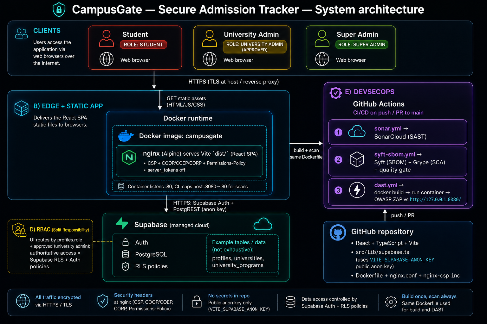

# DevSecOps Security Project — Final Technical Report

**Course:** Cybersecurity: Theory, Tools-L1  
**Project:** CampusGate — Secure Admission Tracker  
**Group:** Project Group 5  
**Repository:** [https://github.com/breehaqasim/CampusGate-Secure-Admission-Tracker](https://github.com/breehaqasim/CampusGate-Secure-Admission-Tracker)  
**Date:** 12 May 2026  
**Authors:** Ashbah Faisal, Breeha Qasim & Namel Shahid

---

## Table of Contents

1. [Executive Summary (non-technical)](#1-executive-summary-non-technical)
2. [Application overview](#2-application-overview)
3. [Architecture & Threat Model](#3-architecture--threat-model)
4. [DevSecOps Pipeline (GitHub / CI-CD)](#4-devsecops-pipeline-github--ci-cd)
5. [Security Testing Methodology](#5-security-testing-methodology)
6. [Vulnerability Discovery & Analysis](#6-vulnerability-discovery--analysis)
7. [Exploitation Report](#7-exploitation-report)
8. [Remediation & Re-test](#8-remediation--re-test)
9. [Residual Risk & Accepted Risks](#9-residual-risk--accepted-risks)
10. [Member Contributions](#10-member-contributions)
11. [References & Appendices](#11-references--appendices)

---

## 1. Executive Summary (non-technical) LEFT

**Purpose.** This document summarises how we designed, built, secured, and tested a containerised web application as part of a DevSecOps module. It is written for instructors and stakeholders who may not read configuration files or vulnerability scanners daily.

**What we built.** We delivered a domain-style admission-tracking application with **role-based access** (admin vs non-admin), **login and logout**, **full CRUD** on core data, **search/filter**, input validation, and a **persistent database** so data survives refresh and server restarts (within normal operation).

**How we secured it.** We followed a **secure development lifecycle**: threat modelling before build; **containerisation** with Docker; automated **SAST** (static code analysis), **SCA** (dependency and image supply-chain scanning), and **DAST** (dynamic testing against a running HTTPS instance); plus **manual** checks for business-logic flaws (e.g. broken access control).

**Key outcomes.**

- **Strengths:** [e.g. Pipeline runs SAST + SCA + DAST on push/PR; quality gates on high/critical where configured; RBAC and sessions documented and tested.]
- **Issues found:** [N] findings across tooling and manual testing; [M] were false positives and excluded with rationale.
- **Remediation:** [X] critical/high issues fixed at root cause; re-test evidence linked to commits and issues (e.g. `fix #12: …`).
- **Remaining risk:** [Briefly: only low/informational items, or explicitly accepted risks with reason — e.g. upstream image CVE with no fix yet.]

**Recommendation.** Continue running the pipeline on every merge to `main`, rotate secrets via GitHub Actions secrets only, and schedule periodic DAST plus manual RBAC/IDOR checks after any feature touching permissions or IDs.

---

## 2. Application overview

### 2.1 Application overview

**Application name:** CampusGate — Secure Admission Tracker  

**Purpose:** A university admission exploration and management experience with **role-based access** for students, university administrators, and a **super admin**. The product supports browsing and favouriting institutions, structured university and program data, and an **admin approval path** for university admins before they reach the full admin dashboard. The system was designed and built as a DevSecOps **“build and break”** security assignment: containerised delivery, automated **SAST / SCA / DAST**, threat modelling, manual testing, and documented remediation.

**Rationale:** **Motivation.** Students and families routinely compare many universities, programmes, fees, and deadlines using scattered websites, PDFs, and spreadsheets—work that is easy to get wrong and hard to repeat each cycle. Institutions also need a controlled way to present **their** offerings and to know **who** is allowed to act on their behalf. CampusGate is motivated as a **small, clear hub**: explore and shortlist institutions, keep structured programme data in one place, and separate **student**, **institution**, and **platform** responsibilities.

**Does this problem really exist?** **Yes.** University admissions and pathway decisions are a recurring, high-stakes process worldwide. Issues that appear in the real world include: **out-of-date or inconsistent programme information**, **weak or opaque account provisioning for “official” reps**, **over-collection or mishandling of personal data**, and **confusion about permissions** (who may edit what). Our project is a **simplified model** of that reality—enough structure to exercise **RBAC, sessions, CRUD, and a database** in a way that still maps to genuine stakeholder pain points, without claiming to replace full national clearinghouse or enrolment systems.

### 2.2 Tech stack

| Layer | Technology |
|--------|------------|
| **Frontend** | React 18, TypeScript, Vite 6, Tailwind CSS 4, MUI, Radix UI, Emotion, react-hook-form, Recharts, `@supabase/supabase-js` |
| **Backend / BaaS** | Supabase (Auth, PostgreSQL, REST/RPC as used by the client) |
| **Database** | PostgreSQL (Supabase); tables include `profiles`, `universities`, `university_programs` |
| **Auth & session** | Supabase Auth; `authService` logout; inactivity timeout in `App.tsx` |
| **RBAC** | `profiles.role`, `approved` (university admin); enforce with Supabase RLS |
| **Containerisation** | Docker (multi-stage: Node 20.19.2-alpine3.21 build, nginx 1.28.3-alpine runtime), `nginx.conf`, `nginx-csp.inc` |
| **CI/CD** | GitHub Actions (SonarCloud, Syft/Grype, ZAP — see §4) |

### 2.3 User roles

| Role | Access level |
|------|----------------|
| **Student** | Register / login; student dashboard; browse **universities** and details; **favourites**; search/filter within the student experience |
| **University admin** | Register / login; if not **`approved`**, remains on login path; once approved — **university admin dashboard** and **CRUD** on managed universities/programs via Supabase |
| **Super admin** | Register / login; **super admin dashboard** — system-wide oversight per that screen’s features |

---

## 3. Architecture & Threat Model

### 3.1 Architecture diagram



*Figure 3.1 — High-level architecture and trust boundaries: HTTPS clients → Docker (nginx, static React/Vite SPA) → Supabase (Auth + PostgreSQL); GitHub repository and Actions for SAST, SCA, and DAST.*

### 3.2 Attack surface

| Entry point | Type | Notes |
|-------------|------|--------|
| HTTPS port 443 | Network | [Public exposure] |
| Login / signup | Auth | [Brute force, enumeration] |
| Authenticated API / RPC | AuthZ | [IDOR, RBAC bypass] |
| File upload (if any) | Input | [Malware, path traversal] |
| Search / forms | Injection / XSS | [Parameterised queries, encoding] |

### 3.3 Threat model methodology

We used **STRIDE** (Spoofing, Tampering, Repudiation, Information disclosure, Denial of service, Elevation of privilege) [and optionally **DREAD** or **risk matrix** with CVSS for prioritisation].

#### 3.3.1 STRIDE per major component

| Component | S | T | R | I | D | E | Mitigation summary |
|-----------|---|---|---|---|---|---|---------------------|
| Browser session | … | … | … | … | … | … | [Cookies HttpOnly; SameSite; CSP] |
| API / edge | … | … | … | … | … | … | [TLS; auth middleware] |
| Database | … | … | … | … | … | … | [RLS / least privilege; backups] |

### 3.4 Threat prioritisation

| Threat ID | Description | Likelihood | Impact | Risk score | Linked test (SAST/DAST/manual) |
|-----------|-------------|------------|--------|------------|--------------------------------|
| TM-01 | [e.g. IDOR on application ID] | Med | High | High | DAST + manual §6 |
| TM-02 | [e.g. Weak session after logout] | Low | Med | Med | Manual §6 |

### 3.5 Threat model updates post-remediation

[Paragraph: what changed after fixes — e.g. reduced exposure from headers, removed packages from image, tightened RBAC. Attach updated diagram if trust boundaries moved.]

---

## 4. DevSecOps Pipeline (GitHub / CI-CD)

### 4.1 Pipeline overview

| Stage | Tool | Trigger | Artifact / output | Pass/fail policy |
|-------|------|---------|-------------------|------------------|
| SAST | [SonarCloud / CodeQL / ESLint security / …] | [push / PR] | [Report name] | [Fail on quality gate / critical issues] |
| SCA | [Grype / Dependabot / Syft SBOM / …] | […] | [SBOM + grype JSON] | [Gate on actionable high/critical — describe your policy] |
| DAST | [OWASP ZAP Baseline / …] | […] | [HTML report] | [Thresholds] |
| Build / Docker | `docker build` | […] | Image for DAST | Must succeed before DAST |

**Evidence:** [Link to Actions run, or screenshot in Appendix A.]

### 4.2 Branching and quality gates

- **Default branch:** `main`  
- **Feature/fix branches:** [e.g. `fix/12-sca-hardening`]  
- **Pull requests:** [required checks: list workflow names]  
- **Issue linkage:** Every meaningful commit message references an issue: `fix #N: …`, `chore #N: …`

### 4.3 Secrets and configuration

Secrets stored only in **GitHub Actions secrets** / hosting provider — not in repository. [List variable *names* only, not values: e.g. `SONAR_TOKEN`, `SUPABASE_URL`.]

---

## 5. Security Testing Methodology

### 5.1 SAST

- **Tool:** [name + version]  
- **Scope:** Full application source  
- **Configuration:** [quality profile / branches]  
- **False positive handling:** [Sonar “won’t fix” / suppression with justification — if any]

### 5.2 SCA

- **Tool:** [Grype / Dependabot / …]  
- **Scope:** Lockfile + container image layers  
- **Policy:** [e.g. fail on fixable critical/high; document accepted upstream risk]

### 5.3 DAST

- **Tool:** OWASP ZAP [Baseline / Full]  
- **Target:** [HTTPS base URL]  
- **Authentication:** [ZAP context / test users — do not paste real passwords in report; reference vault]

### 5.4 Manual penetration testing

- **Focus:** RBAC, IDOR, session lifecycle, business logic (mass assignment, negative values, step skipping)  
- **Tools:** Burp Suite Community / browser DevTools [as used]  
- **Timebox:** [dates — Week 3]

---

## 6. Vulnerability Discovery & Analysis

### 6.1 Summary table (master findings register)

| ID | Title | Source (SAST/SCA/DAST/Manual) | OWASP 2021 | Severity | CVSS v3.1 Base | Vector | Status |
|----|--------|-------------------------------|------------|----------|----------------|--------|--------|
| F-01 | [e.g. Missing Permissions-Policy] | DAST (ZAP 10063) | A05 Security Misconfiguration | Low | [x.x] | [CVSS:3.1/…] | Fixed |
| F-02 | [e.g. Server header leaks version] | DAST (ZAP 10036) | A05 | Low | … | … | Fixed |
| F-03 | [e.g. SCA: image package] | SCA (Grype) | A06 Vulnerable Components | High | … | … | Fixed / Accepted |
| F-04 | [e.g. IDOR on `/api/...`] | Manual | A01 Broken Access Control | High | … | … | Open / Fixed |

*Add one row per real finding. Remove rows that were false positives (document them in §6.3).*

### 6.2 Detailed finding template (repeat per finding)

#### Finding F-XX — [Title]

| Attribute | Value |
|-----------|--------|
| **Severity** | Critical / High / Medium / Low / Info |
| **CVSS v3.1** | Base **X.X** — Vector `CVSS:3.1/AV:…/AC:…/PR:…/UI:…/S:…/C:…/I:…/A:…` |
| **OWASP Top 10 (2021)** | [e.g. A05 Security Misconfiguration] |
| **CWE** | [if known, e.g. CWE-693] |
| **Affected component** | [URL path, file, package name@version] |
| **Description** | [What is wrong] |
| **Prerequisites** | [Unauthenticated / user role / admin] |
| **Evidence** | Screenshot: `Appendix/Screenshots/F-XX-*.png`; HTTP snippet below |

**HTTP request (redacted):**

```http
[Method] [path] HTTP/1.1
Host: [hostname]
Cookie: [REDACTED]
...
```

**Vulnerable response (summary):** [status + header/body indicator]

**Safe response (expected after fix):** […]

**False positive check:** [Why this is a true positive — e.g. reproducible in two browsers / two accounts]

---

### 6.3 False positives excluded

| Tool claim | Why excluded | Evidence |
|------------|--------------|----------|
| [e.g. stdlib Go CVE in SBOM metadata] | Not part of deployed app; scanner noise | [Commit / workflow change reference] |

---

## 7. Exploitation Report

> Demonstrate **impact** and **reproducibility**. For coursework, only exploit systems you are authorised to test.

### 7.1 Exploitation summary

| Finding ID | Exploit type | Impact | PoC location |
|------------|----------------|--------|----------------|
| F-04 | [e.g. IDOR] | Read other users’ records | §7.2 |
| … | [e.g. Chained XSS → session] | […] | §7.3 |

### 7.2 Step-by-step PoC — [Finding F-04]

1. **Prerequisites:** [Account A (student), known resource ID belonging to B]  
2. **Steps:**  
   1. Login as A.  
   2. Open Burp Repeater, request `GET /api/.../123`.  
   3. Change `123` → `456` (B’s ID).  
3. **Observed:** [200 + PII / 403 — describe]  
4. **Screenshots:** [Appendix refs]  
5. **Attacker value:** [Privacy breach / grade tampering / …]

### 7.3 Chained exploit (if demonstrated)

**Chain:** [e.g. Stored XSS → token theft → admin action]

| Step | Technique | Result |
|------|-----------|--------|
| 1 | … | … |
| 2 | … | … |

**Limitation (honest):** [e.g. HttpOnly cookie prevented cookie theft; chain stopped at step 2 — document actual behaviour.]

---

## 8. Remediation & Re-test

### 8.1 Remediation summary

| Finding ID | Root cause | Fix implemented | Commit / PR | Issue |
|--------------|------------|-----------------|-------------|-------|
| F-01 | Missing header | Added `Permissions-Policy` in `nginx-csp.inc` | `abc1234` | #N |
| F-02 | `server_tokens` default | `server_tokens off;` in `nginx.conf` | … | #N |

### 8.2 Re-test methodology

For each fixed finding:

1. Deploy commit **[hash]** to **[environment]**.  
2. Repeat **exact** PoC steps from §7.  
3. Capture **after** screenshots and pipeline green run.

### 8.3 Re-test results

| Finding ID | Before | After | Verified by |
|------------|--------|-------|---------------|
| F-01 | [ZAP alert] | Pass / no alert | ZAP [date]; screenshot |
| … | … | … | … |

### 8.4 Pipeline evidence post-fix

- **Workflow run URL:** [GitHub Actions link]  
- **Outcome:** [All required jobs green]

---

## 9. Residual Risk & Accepted Risks

| ID | Risk | Severity | Reason accepted | Compensating control | Review date |
|----|------|----------|-----------------|----------------------|-------------|
| R-01 | [e.g. upstream image CVE no fix] | Low | `fix.state: unknown` | Re-scan weekly; pin digest when patched | [date] |

---

## 10. Member Contributions

> Align with rubric: verifiable via GitHub Insights; each member owns deliverables.

| Member | Primary responsibilities | Evidence (issues, PRs, sections) |
|--------|----------------------------|-----------------------------------|
| [Name 1] | App features, RBAC, DB | Commits: [area]; Report §2–3 |
| [Name 2] | Docker, nginx, SCA/DAST in CI | Workflows; Report §4, §8 |
| [Name 3] | Threat model, pentest, report | Threat model doc; Report §6–7 |

**AI usage (per course policy):** [Brief statement: AI assisted with drafting / tooling; all findings explained and verified by the team; viva preparation per member.]

---

## 11. References & Appendices

### 11.1 References

- OWASP Top 10 (2021): [https://owasp.org/Top10/](https://owasp.org/Top10/)  
- CVSS v3.1 Specification: [https://www.first.org/cvss/v3.1/specification-document](https://www.first.org/cvss/v3.1/specification-document)  
- NIST CVSS Calculator: [https://nvd.nist.gov/vuln-metrics/cvss/v3-calculator](https://nvd.nist.gov/vuln-metrics/cvss/v3-calculator)  
- Course — GitHub pushes & issues: [Canvas link](https://hulms.instructure.com/courses/4979/pages/associating-issues-with-your-gitpushes?module_item_id=186694)

### 11.2 Appendix A — Screenshots index

| File | Description |
|------|-------------|
| `appendix/screenshots/01-architecture.png` | Architecture / DFD |
| `appendix/screenshots/02-zap-before.png` | DAST before remediation |
| `appendix/screenshots/03-zap-after.png` | DAST after remediation |
| … | … |

### 11.3 Appendix B — Raw tool outputs (optional)

Store large JSON/HTML reports in repo `appendix/` or attach as ZIP per course instructions. **Do not** commit production secrets or live passwords.

### 11.4 Appendix C — Issue ↔ commit mapping (sample)

| Issue | Title | Representative commits |
|-------|--------|-------------------------|
| #12 | [Title] | `fix #12: …` |

---

## Document control

| Version | Date | Author | Changes |
|---------|------|--------|---------|
| 0.1 | [date] | [names] | Initial draft |
| 1.0 | [date] | [names] | Final for submission |

---

*End of report template — replace all bracketed placeholders with your project-specific content before submission.*
